# Laporan Praktikum Jarkom Modul 2

| Nama | NRP |
| --- | --- |
| Nayarfa Syamahira Dyananta | 5027251046 |
| Rido Patra Yudhistira Edwin | 5027251120 |

## 1. Konfigurasi Topologi & Pengalamatan IP Network

### A. Analisis Topologi & Alokasi Alamat IP

Pada konfigurasi topologi **The Mesh**, node **`rootkit`** bertindak sebagai *router* utama (gateway) yang menghubungkan seluruh segmen jaringan internal ke koneksi luar (NAT WAN) serta membagi lalu lintas data ke 5 Switch utama.

Pengalamatan IP menggunakan skema subnetting kelas C (`255.255.255.0` / `/24`) dengan prefix khusus kelompok **`192.233.X.Y`**.

#### Tabel Alokasi Alamat IP Entitas

| Segment / Fungsi | Node Name | Interface | IP Address | Subnet Mask | Default Gateway |
| --- | --- | --- | --- | --- | --- |
| **Router Utama** | `rootkit` | `eth0` | *DHCP (NAT)* | - | - |
|  |  | `eth1` | `192.233.1.1` | `255.255.255.0` | - |
|  |  | `eth2` | `192.233.2.1` | `255.255.255.0` | - |
|  |  | `eth3` | `192.233.3.1` | `255.255.255.0` | - |
|  |  | `eth4` | `192.233.4.1` | `255.255.255.0` | - |
|  |  | `eth5` | `192.233.5.1` | `255.255.255.0` | - |
|  |  | `eth5:0` | `192.233.6.1` | `255.255.255.0` | - |
| **Operator (Sayap Kiri)** | `alpha` | `eth0` | `192.233.1.2` | `255.255.255.0` | `192.233.1.1` |
|  | `beta` | `eth0` | `192.233.1.3` | `255.255.255.0` | `192.233.1.1` |
|  | `gamma` | `eth0` | `192.233.1.4` | `255.255.255.0` | `192.233.1.1` |
| **Operator (Sayap Kanan)** | `delta` | `eth0` | `192.233.2.2` | `255.255.255.0` | `192.233.2.1` |
|  | `epsilon` | `eth0` | `192.233.2.3` | `255.255.255.0` | `192.233.2.1` |
| **Gerbang Penyaring (Proxy)** | `abbey` | `eth0` | `192.233.3.2` | `255.255.255.0` | `192.233.3.1` |
|  | `penny` | `eth0` | `192.233.4.2` | `255.255.255.0` | `192.233.4.1` |
| **Penjaga Directory (DNS)** | `prab` | `eth0` | `192.233.5.2` | `255.255.255.0` | `192.233.5.1` |
|  | `tedd` | `eth0` | `192.233.5.3` | `255.255.255.0` | `192.233.5.1` |
| **Repository (Vault Backend)** | `obladi` | `eth0` | `192.233.6.2` | `255.255.255.0` | `192.233.6.1` |
|  | `desmond` | `eth0` | `192.233.6.3` | `255.255.255.0` | `192.233.6.1` |
| **Repository (Core Backend)** | `oblada` | `eth0` | `192.233.6.4` | `255.255.255.0` | `192.233.6.1` |
|  | `molly` | `eth0` | `192.233.6.5` | `255.255.255.0` | `192.233.6.1` |

---

### B. Skrip Konfigurasi Jaringan `/etc/network/interfaces`

#### Router / Gateway (`rootkit`)

**File / Lokasi:** `/etc/network/interfaces` pada node **`rootkit`**

```bash
# NAT WAN (eth0)
auto eth0
iface eth0 inet dhcp

# Switch 6 (Klien Sayap Kiri: Alpha, Beta, Gamma)
auto eth1
iface eth1 inet static
    address 192.233.1.1
    netmask 255.255.255.0

# Switch 7 (Klien Sayap Kanan: Delta, Epsilon)
auto eth2
iface eth2 inet static
    address 192.233.2.1
    netmask 255.255.255.0

# Switch 4 (Reverse Proxy Abbey)
auto eth3
iface eth3 inet static
    address 192.233.3.1
    netmask 255.255.255.0

# Switch 5 (Reverse Proxy Penny)
auto eth4
iface eth4 inet static
    address 192.233.4.1
    netmask 255.255.255.0

# Switch 1 -> Switch 2 (DNS Prab & Tedd)
auto eth5
iface eth5 inet static
    address 192.233.5.1
    netmask 255.255.255.0

# Switch 1 -> Switch 3 (Area Vault & Core)
auto eth5:0
iface eth5:0 inet static
    address 192.233.6.1
    netmask 255.255.255.0
```

---

#### Operator Client (`alpha`, `beta`, `gamma`, `delta`, `epsilon`)

* **`alpha`** (`/etc/network/interfaces`):
```bash
auto eth0
iface eth0 inet static
    address 192.233.1.2
    netmask 255.255.255.0
    gateway 192.233.1.1
```

* **`beta`** (`/etc/network/interfaces`):
```bash
auto eth0
iface eth0 inet static
    address 192.233.1.3
    netmask 255.255.255.0
    gateway 192.233.1.1
```

* **`gamma`** (`/etc/network/interfaces`):
```bash
auto eth0
iface eth0 inet static
    address 192.233.1.4
    netmask 255.255.255.0
    gateway 192.233.1.1
```

* **`delta`** (`/etc/network/interfaces`):
```bash
auto eth0
iface eth0 inet static
    address 192.233.2.2
    netmask 255.255.255.0
    gateway 192.233.2.1
```

* **`epsilon`** (`/etc/network/interfaces`):
```bash
auto eth0
iface eth0 inet static
    address 192.233.2.3
    netmask 255.255.255.0
    gateway 192.233.2.1
```

---

#### Reverse Proxy (`abbey`, `penny`)

* **`abbey`** (`/etc/network/interfaces`):
```bash
auto eth0
iface eth0 inet static
    address 192.233.3.2
    netmask 255.255.255.0
    gateway 192.233.3.1
```

* **`penny`** (`/etc/network/interfaces`):
```bash
auto eth0
iface eth0 inet static
    address 192.233.4.2
    netmask 255.255.255.0
    gateway 192.233.4.1
```

---

#### Server DNS (`prab`, `tedd`)

* **`prab`** (`/etc/network/interfaces`):
```bash
auto eth0
iface eth0 inet static
    address 192.233.5.2
    netmask 255.255.255.0
    gateway 192.233.5.1
```

* **`tedd`** (`/etc/network/interfaces`):
```bash
auto eth0
iface eth0 inet static
    address 192.233.5.3
    netmask 255.255.255.0
    gateway 192.233.5.1
```

---

#### Server Backend Repository (`obladi`, `desmond`, `oblada`, `molly`)

* **`obladi`** (`/etc/network/interfaces`):
```bash
auto eth0
iface eth0 inet static
    address 192.233.6.2
    netmask 255.255.255.0
    gateway 192.233.6.1
```

* **`desmond`** (`/etc/network/interfaces`):
```bash
auto eth0
iface eth0 inet static
    address 192.233.6.3
    netmask 255.255.255.0
    gateway 192.233.6.1
```

* **`oblada`** (`/etc/network/interfaces`):
```bash
auto eth0
iface eth0 inet static
    address 192.233.6.4
    netmask 255.255.255.0
    gateway 192.233.6.1
```

* **`molly`** (`/etc/network/interfaces`):
```bash
auto eth0
iface eth0 inet static
    address 192.233.6.5
    netmask 255.255.255.0
    gateway 192.233.6.1
```

### C. Dokumentasi

**Hasil Topologi**

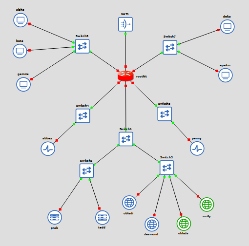

---

## 2. Konfigurasi Network Address Translation (NAT) & Akses Internet

### A. Analisis & Cara Kerja Konfigurasi NAT

Agar seluruh host di dalam jaringan internal **The Mesh** (seperti `alpha`, `prab`, `penny`, `obladi`, dll.) yang menggunakan alokasi IP privat (`192.233.X.Y`) dapat terhubung ke internet publik, node **`rootkit`** harus dikonfigurasikan sebagai router penyambung dengan fitur **Network Address Translation (NAT)**.

Mekanisme kerja konfigurasi ini terdiri dari dua komponen utama:

1. **IP Forwarding Kernel (`sysctl -w net.ipv4.ip_forward=1`)**: Mengizinkan kernel Linux pada `rootkit` untuk meneruskan paket data antar-antarmuka (*interface*), yaitu memfasilitasi lalu lintas dari antarmuka internal (`eth1` hingga `eth5`) menuju antarmuka WAN (`eth0`).
2. **IP Masquerading (`iptables -t nat -A POSTROUTING -o eth0 -j MASQUERADE`)**: Mengubah alamat IP asal (*source IP*) dari paket data yang berasal dari IP privat internal menjadi alamat IP publik/DHCP milik antarmuka `eth0` saat paket keluar menuju NAT/Internet. Saat balasan dari luar diterima, `rootkit` akan mengembalikan alamat IP tujuan ke host internal yang meminta.

Aturan ini dipasang secara otomatis menggunakan pengait (*hook*) `post-up` pada file konfigurasi jaringan `eth0` agar NAT langsung aktif setiap kali antarmuka WAN menyala.

---

### B. Skrip Inisialisasi NAT Router (`rootkit`)

**File / Lokasi:** `/root/script.sh` pada node **`rootkit`**

```bash
#!/bin/bash

# 1. Mengaktifkan IP Forwarding di tingkat kernel Linux
sysctl -w net.ipv4.ip_forward=1

# 2. Membersihkan aturan NAT lama (opsional untuk reset)
iptables -t nat -F

# 3. Mengaktifkan MASQUERADE pada interface WAN (eth0 yang terhubung ke NAT)
iptables -t nat -A POSTROUTING -o eth0 -j MASQUERADE
```

*Catatan: Berikan izin eksekusi pada skrip dengan menjalankan `chmod +x /root/script.sh` pada terminal `rootkit`.*

---

### C. Cara Pengujian & Verifikasi Akses Internet

Pengujian dilakukan dengan mengirimkan paket ICMP (`ping`) ke IP DNS Publik Google (`8.8.8.8`) dari representasi host internal pada segmen jaringan yang berbeda (misalnya klien `alpha` di Switch 6 dan server DNS `prab` di Switch 2).

### D. Pengujian dari Klien (`alpha`)

**Lokasi Eksekusi:** Terminal node **`alpha`**

```bash
ping -c 4 8.8.8.8
```

**Ekspektasi Output:**

```text
PING 8.8.8.8 (8.8.8.8) 56(84) bytes of data.
64 bytes from 8.8.8.8: icmp_seq=1 ttl=115 time=18.2 ms
64 bytes from 8.8.8.8: icmp_seq=2 ttl=115 time=17.9 ms
64 bytes from 8.8.8.8: icmp_seq=3 ttl=115 time=18.1 ms
64 bytes from 8.8.8.8: icmp_seq=4 ttl=115 time=17.8 ms

--- 8.8.8.8 ping statistics ---
4 packets transmitted, 4 received, 0% packet loss, time 3004ms
rtt min/avg/max/mdev = 17.812/18.005/18.214/0.150 ms
```

---

### E. Pengujian dari Server DNS (`prab`)

**Lokasi Eksekusi:** Terminal node **`prab`**

```bash
ping -c 4 8.8.8.8

```

**Output:**

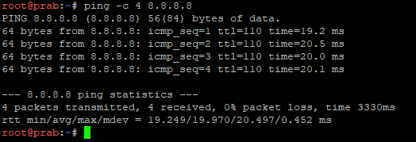

---

## 3. Konektivitas Antar-Node, DNS Resolver, dan Otomatisasi Instalasi Tools

### A. Analisis Konfigurasi & Cara Kerja

Pada **Soal Nomor 3**, seluruh host non-router dalam jaringan *The Mesh* dikonfigurasikan agar dapat saling terhubung antar-subnet via router **`rootkit`**, dapat melakukan resolusi nama domain (*DNS resolution*) untuk mengunduh paket instalasi dari internet, serta menjalankan instalasi perangkat lunak pendukung secara otomatis saat sistem pertama kali diaktifkan.

Terdapat tiga aspek penting dalam konfigurasi ini:

1. **Injeksi DNS Resolver (`up` Directive):**
Setiap antarmuka dikonfigurasikan dengan arahan `up` untuk menyuntikkan IP DNS resolver `192.168.122.1` (resolver default NAT lingkungan virtual) dan `8.8.8.8` (DNS Google) secara langsung ke dalam berkas `/etc/resolv.conf` saat antarmuka jaringan diaktifkan (*up*). Hal ini menjamin host dapat menyelesaikan nama domain seperti `deb.debian.org` untuk kebutuhan pengunduhan repositori tanpa bergantung pada DNS internal yang belum dikonfigurasi.
2. **Default Gateway & Internal Routing:**
Seluruh host diarahkan menggunakan IP interface `rootkit` yang berada di subnet-nya masing-masing sebagai *default gateway*. Hal ini memungkinkan lalu lintas data antar-subnet (misalnya dari Klien `alpha` di Subnet 1 menuju Backend `obladi` di Subnet 6) dapat diteruskan secara seamless oleh router `rootkit`.
3. **Otomatisasi Instalasi Paket (`post-up` Directive):**
Opsi `post-up bash /root/script.sh` digunakan pada setiap antarmuka untuk mengeksekusi skrip instalasi perangkat lunak sesuai peran node masing-masing (klien, DNS server, reverse proxy, maupun backend server) segera setelah koneksi jaringan aktif.

---

### B. Konfigurasi Interface Network (`/etc/network/interfaces`)

Berikut adalah konfigurasi berkas `/etc/network/interfaces` pada seluruh node non-router:

#### Operator Client (`alpha`, `beta`, `gamma`, `delta`, `epsilon`)

* **`alpha`** (`/etc/network/interfaces`):
```bash
auto eth0
iface eth0 inet static
    address 192.233.1.2
    netmask 255.255.255.0
    gateway 192.233.1.1

    dns-nameservers 192.168.122.1

    up echo "nameserver 192.168.122.1" > /etc/resolv.conf
    up echo "nameserver 8.8.8.8" >> /etc/resolv.conf

    post-up bash /root/script.sh
```


* **`beta`** (`/etc/network/interfaces`):
```bash
auto eth0
iface eth0 inet static
    address 192.233.1.3
    netmask 255.255.255.0
    gateway 192.233.1.1

    dns-nameservers 192.168.122.1

    up echo "nameserver 192.168.122.1" > /etc/resolv.conf
    up echo "nameserver 8.8.8.8" >> /etc/resolv.conf

    post-up bash /root/script.sh
```


* **`gamma`** (`/etc/network/interfaces`):
```bash
auto eth0
iface eth0 inet static
    address 192.233.1.4
    netmask 255.255.255.0
    gateway 192.233.1.1

    dns-nameservers 192.168.122.1

    up echo "nameserver 192.168.122.1" > /etc/resolv.conf
    up echo "nameserver 8.8.8.8" >> /etc/resolv.conf

    post-up bash /root/script.sh
```


* **`delta`** (`/etc/network/interfaces`):
```bash
auto eth0
iface eth0 inet static
    address 192.233.2.2
    netmask 255.255.255.0
    gateway 192.233.2.1

    dns-nameservers 192.168.122.1

    up echo "nameserver 192.168.122.1" > /etc/resolv.conf
    up echo "nameserver 8.8.8.8" >> /etc/resolv.conf

    post-up bash /root/script.sh
```


* **`epsilon`** (`/etc/network/interfaces`):
```bash
auto eth0
iface eth0 inet static
    address 192.233.2.3
    netmask 255.255.255.0
    gateway 192.233.2.1

    dns-nameservers 192.168.122.1

    up echo "nameserver 192.168.122.1" > /etc/resolv.conf
    up echo "nameserver 8.8.8.8" >> /etc/resolv.conf

    post-up bash /root/script.sh
```

---

#### Reverse Proxy (`abbey`, `penny`)

* **`abbey`** (`/etc/network/interfaces`):
```bash
auto eth0
iface eth0 inet static
    address 192.233.3.2
    netmask 255.255.255.0
    gateway 192.233.3.1

    dns-nameservers 192.168.122.1

    up echo "nameserver 192.168.122.1" > /etc/resolv.conf
    up echo "nameserver 8.8.8.8" >> /etc/resolv.conf

    post-up bash /root/script.sh
```

* **`penny`** (`/etc/network/interfaces`):
```bash
auto eth0
iface eth0 inet static
    address 192.233.4.2
    netmask 255.255.255.0
    gateway 192.233.4.1

    dns-nameservers 192.168.122.1

    up echo "nameserver 192.168.122.1" > /etc/resolv.conf
    up echo "nameserver 8.8.8.8" >> /etc/resolv.conf

    post-up bash /root/script.sh
```

---

#### Server DNS (`prab`, `tedd`)

* **`prab`** (`/etc/network/interfaces`):
```bash
auto eth0
iface eth0 inet static
    address 192.233.5.2
    netmask 255.255.255.0
    gateway 192.233.5.1

    dns-nameservers 192.168.122.1

    up echo "nameserver 192.168.122.1" > /etc/resolv.conf
    up echo "nameserver 8.8.8.8" >> /etc/resolv.conf

    post-up bash /root/script.sh
```

* **`tedd`** (`/etc/network/interfaces`):
```bash
auto eth0
iface eth0 inet static
    address 192.233.5.3
    netmask 255.255.255.0
    gateway 192.233.5.1

    dns-nameservers 192.168.122.1

    up echo "nameserver 192.168.122.1" > /etc/resolv.conf
    up echo "nameserver 8.8.8.8" >> /etc/resolv.conf

    post-up bash /root/script.sh
```

---

#### Server Backend Repository (`obladi`, `desmond`, `oblada`, `molly`)

* **`obladi`** (`/etc/network/interfaces`):
```bash
auto eth0
iface eth0 inet static
    address 192.233.6.2
    netmask 255.255.255.0
    gateway 192.233.6.1

    dns-nameservers 192.168.122.1

    up echo "nameserver 192.168.122.1" > /etc/resolv.conf
    up echo "nameserver 8.8.8.8" >> /etc/resolv.conf

    post-up bash /root/script.sh
```

* **`desmond`** (`/etc/network/interfaces`):
```bash
auto eth0
iface eth0 inet static
    address 192.233.6.3
    netmask 255.255.255.0
    gateway 192.233.6.1

    dns-nameservers 192.168.122.1

    up echo "nameserver 192.168.122.1" > /etc/resolv.conf
    up echo "nameserver 8.8.8.8" >> /etc/resolv.conf

    post-up bash /root/script.sh
```

* **`oblada`** (`/etc/network/interfaces`):
```bash
auto eth0
iface eth0 inet static
    address 192.233.6.4
    netmask 255.255.255.0
    gateway 192.233.6.1

    dns-nameservers 192.168.122.1

    up echo "nameserver 192.168.122.1" > /etc/resolv.conf
    up echo "nameserver 8.8.8.8" >> /etc/resolv.conf

    post-up bash /root/script.sh
```

* **`molly`** (`/etc/network/interfaces`):
```bash
auto eth0
iface eth0 inet static
    address 192.233.6.5
    netmask 255.255.255.0
    gateway 192.233.6.1

    dns-nameservers 192.168.122.1

    up echo "nameserver 192.168.122.1" > /etc/resolv.conf
    up echo "nameserver 8.8.8.8" >> /etc/resolv.conf

    post-up bash /root/script.sh
```

---

### C. Skrip Instalasi Tools (`/root/script.sh`) Berdasarkan Peran Node

Berikut adalah isi berkas `/root/script.sh` yang dipasang pada masing-masing kelompok node untuk kebutuhan otomasi instalasi dependensi software:

#### Client Node (`alpha`, `beta`, `gamma`, `delta`, `epsilon`)

Menginstal perkakas analisis DNS, transfer HTTP, dan autentikasi dasar.

```bash
#!/bin/bash

apt-get update
apt-get install -y dnsutils curl apache2-utils
```

#### DNS Server Master (`prab`)

Menginstal paket DNS Server Bind9 dan perkakas pendukungnya.

```bash
#!/bin/bash

apt-get update
apt-get install -y bind9 bind9utils
```

#### DNS Server Slave (`tedd`)

Menginstal paket DNS Server Bind9.

```bash
#!/bin/bash

apt-get update
apt-get install -y bind9
```

#### Reverse Proxy Core (`abbey`)

Menginstal web server Nginx.

```bash
#!/bin/bash

apt-get update
apt-get install -y nginx
```

#### Reverse Proxy Vault (`penny`)

Menginstal web server Apache2, engine PHP, serta mengaktifkan modul-modul reverse proxy, header forwarding, rewrite, dan basic auth.

```bash
#!/bin/bash

apt-get update
apt-get install -y apache2 php libapache2-mod-php
a2enmod proxy proxy_http headers rewrite auth_basic
```

#### Vault Backend Repository (`obladi`, `desmond`)

Menginstal web server Apache2.

```bash
#!/bin/bash

apt-get update
apt-get install -y apache2
```

#### Core Backend Repository (`oblada`, `molly`)

Menginstal web server Nginx dan pemroses skrip PHP-FPM.

```bash
#!/bin/bash

apt-get update
apt-get install -y nginx php-fpm
```

---

### D. Cara Pengujian & Verifikasi Hasil

Pengujian dilakukan untuk memastikan **dua kriteria utama**: konektivitas routing antar-subnet internal dan keberhasilan resolusi domain ke repositori publik internet.

#### Perintah Pengujian

Jalankan perintah pengujian berikut pada terminal **`alpha`** (Klien) atau **`obladi`** (Backend):

1. **Uji Konektivitas Lintas Subnet (Inter-Subnet Ping):**
```bash
ping -c 2 192.233.6.2
```

2. **Uji Resolusi Domain & Akses Repositori Internet:**
```bash
ping -c 2 deb.debian.org
```

---

#### Ekspektasi Output Pengujian

1. **Hasil Ping Inter-Subnet (`alpha` $\rightarrow$ `obladi`):**

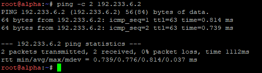

2. **Hasil Ping Domain Repositori (`deb.debian.org`):**

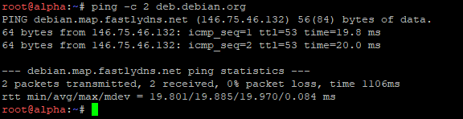

---

## 4. Konfigurasi Master & Slave DNS Server (k44.com) serta Pembaruan Resolver Network

### A. Analisis Konfigurasi & Cara Kerja

Pada **Soal Nomor 4**, sistem penamaan domain internal (*Domain Name System*) dibangun secara berhierarki menggunakan **Bind9** pada dua server penjamin nama (*Penjaga Direktori*), yaitu **`prab`** sebagai **Master DNS Server** dan **`tedd`** sebagai **Slave DNS Server** untuk zona **`k44.com`**.

Berikut adalah rincian komponen dan mekanisme kerja dari konfigurasi ini:

1. **Konfigurasi Master DNS Server (`prab`):**
* **SOA (Start of Authority):** Menunjuk ke `prab.k44.com.` dengan penanggung jawab `admin.k44.com.`.
* **NS Record:** Dideklarasikan dua name server resmi untuk domain `k44.com`, yaitu `prab.k44.com.` dan `tedd.k44.com.`.
* **A Record Domain Apex (`k44.com`):** Mengarah ke alamat IP **`penny`** (`192.233.4.2`) sebagai gerbang reverse proxy aplikasi dinamis.
* **A Record Hostname:** Pemetaan nama `prab.k44.com` ke IP `192.233.5.2` dan `tedd.k44.com` ke IP `192.233.5.3`.
* **Zone Transfer & Notification:** Parameter `allow-transfer { 192.233.5.3; };` dan `also-notify { 192.233.5.3; };` diaktifkan agar `prab` mengizinkan pengunduhan berkas zona dan memberikan notifikasi otomatis ke `tedd` setiap kali ada perubahan serial berkas DNS.
* **Forwarders:** Mengarahkan query domain di luar `k44.com` ke gateway NAT `192.168.122.1`.


2. **Konfigurasi Slave DNS Server (`tedd`):**
* Mengkonfigurasikan tipe zona `slave` yang mereplikasi data zona `k44.com` secara otomatis dari master IP `192.233.5.2` (`prab`) dan menyimpannya di `/var/cache/bind/db.k44.com`.
* `tedd` mampu menjawab query DNS secara *authoritative* mandiri apabila `prab` mengalami downtime (*redundancy/failover*).


3. **Pembaruan Hierarki DNS Resolver pada Seluruh Host Non-Router:**
* Seluruh host non-router memperbarui urutan pendaftaran DNS resolver pada berkas `/etc/resolv.conf` menjadi:
1. `192.233.5.2` (IP `prab` - Primary DNS)
2. `192.233.5.3` (IP `tedd` - Secondary DNS)
3. `192.168.122.1` (NAT Gateway - Public DNS Resolver)

---

### B. Skrip Konfigurasi & Lokasi Pemasangan

#### Skrip Konfigurasi DNS Master (`prab`)

**File / Lokasi:** Eksekusi pada berkas `/root/script.sh` atau konfigurasi Bind9 di node **`prab`**

```bash
#!/bin/bash

# A. Set Forwarders ke NAT Gateway
cat << 'EOF' > /etc/bind/named.conf.options
options {
    directory "/var/cache/bind";
    forwarders {
        192.168.122.1;
    };
    allow-query { any; };
    auth-nxdomain no;
    listen-on-v6 { any; };
};
EOF

# B. Deklarasi Zone Master k44.com
cat << 'EOF' > /etc/bind/named.conf.local
zone "k44.com" {
    type master;
    file "/etc/bind/db.k44.com";
    allow-transfer { 192.233.5.3; }; # IP Tedd
    also-notify { 192.233.5.3; };    # Notify ke Tedd
};
EOF

# C. Buat File Database Zone db.k44.com
cat << 'EOF' > /etc/bind/db.k44.com
$TTL    604800
@       IN      SOA     prab.k44.com. admin.k44.com. (
                              2026092901 ; Serial
                                  604800 ; Refresh
                                   86400 ; Retry
                                 2419200 ; Expire
                                  604800 ) ; TTL
;
@       IN      NS      prab.k44.com.
@       IN      NS      tedd.k44.com.

; Apex domain k44.com mengarah ke IP Penny (192.233.4.2)
@       IN      A       192.233.4.2

; A record Name Server
prab    IN      A       192.233.5.2
tedd    IN      A       192.233.5.3
EOF

# D. Check Syntax & Reload Service
named-checkconf
named-checkzone k44.com /etc/bind/db.k44.com

named -u bind 2>/dev/null || true
rndc reload || /etc/init.d/bind9 restart
```

---

#### Skrip Konfigurasi DNS Slave (`tedd`)

**File / Lokasi:** Eksekusi pada berkas `/root/script.sh` atau konfigurasi Bind9 di node **`tedd`**

```bash
#!/bin/bash

# A. Deklarasi Zone Slave k44.com
cat << 'EOF' > /etc/bind/named.conf.local
zone "k44.com" {
    type slave;
    file "/var/cache/bind/db.k44.com";
    masters { 192.233.5.2; }; # IP Prab
};
EOF

# B. Check Syntax & Reload Service
named-checkconf

named -u bind 2>/dev/null || true
rndc reload || /etc/init.d/bind9 restart
```

---

#### Konfigurasi Network Interface Seluruh Node Non-Router

**File / Lokasi:** `/etc/network/interfaces` pada seluruh node non-router (`alpha`, `beta`, `gamma`, `delta`, `epsilon`, `abbey`, `penny`, `prab`, `tedd`, `obladi`, `desmond`, `oblada`, `molly`)

```bash
auto eth0
iface eth0 inet static
    address <ip_address_node>
    netmask 255.255.255.0
    gateway <ip_gateway_subnet>

    dns-nameservers 192.233.5.2 192.233.5.3 192.168.122.1

    # Auto-run pencatatan urutan DNS Resolver pada /etc/resolv.conf
    up echo -e "nameserver 192.233.5.2\nnameserver 192.233.5.3\nnameserver 192.168.122.1" > /etc/resolv.conf
    up echo "nameserver 8.8.8.8" >> /etc/resolv.conf 

    # Auto-run skrip saat interface up
    post-up bash /root/script.sh
```

---

### C. Cara Pengujian & Verifikasi Hasil

Pengujian dilakukan dari terminal Klien **`alpha`** untuk memverifikasi bahwa query DNS domain apex maupun hostname dijawab secara *authoritative* baik oleh DNS Master (`prab`) maupun DNS Slave (`tedd`).

#### Perintah Pengujian

Jalankan perintah berikut pada terminal **`alpha`**:

```bash
# 1. Tes query Apex Domain k44.com ke Prab (Master) & Tedd (Slave)
dig @192.233.5.2 k44.com +short
dig @192.233.5.3 k44.com +short

# 2. Tes query Hostname prab dan tedd
host prab.k44.com
host tedd.k44.com

# 3. Tes Ping ke Domain Apex k44.com
ping -c 2 k44.com
```

---

#### Ekspektasi Output Hasil Pengujian

1. **Hasil Query `dig` Domain Apex (`k44.com`):**

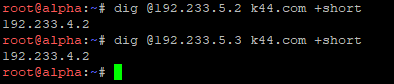

2. **Hasil Query `host` Hostname Name Server:**

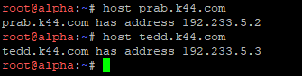

3. **Hasil Ping ke Apex Domain (`k44.com`):**

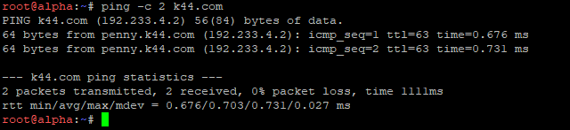

---

## 5. Konfigurasi Hostname System-Wide dan Pemetaan Domain Seluruh Node (k44.com)

### A. Analisis Konfigurasi & Cara Kerja

Pada **Soal Nomor 5**, sistem jaringan *The Mesh* melakukan standardisasi identitas seluruh entitas baik secara lokal di tingkat sistem operasi (*system-wide hostname*) maupun secara global pada jaringan melalui pendaftaran record FQDN (*Fully Qualified Domain Name*) pada server DNS **`k44.com`**.

Berikut adalah rincian komponen dan mekanisme teknis dari konfigurasi ini:

1. **Penetapan Hostname System-Wide:**
* Setiap node menjalankan perintah `hostname <nama_node>` untuk mendefinisikan nama host lokal yang dikenali oleh kernel Linux dan perintah sistem secara langsung.


2. **Pembaruan Berkas Zona DNS Master (`prab`):**
* **Inkremen Serial SOA:** Angka serial SOA pada berkas `/etc/bind/db.k44.com` dinaikkan menjadi **`2026092902`** (dari `2026092901` pada Soal 4). Perubahan nomor serial ini wajib dilakukan agar DNS Slave mengenali adanya pembaruan data pada DNS Master.
* **Pengecualian Record `prab` & `tedd`:** A Record untuk `prab.k44.com` (`192.233.5.2`) dan `tedd.k44.com` (`192.233.5.3`) tetap dipertahankan sesuai konfigurasi awal pada Soal 4 tanpa perubahan.
* **Pemetaan A Record Seluruh Entitas:** Menambahkan entri A Record baru untuk seluruh node non-DNS sesuai dengan segmen alamat IP statisnya:
* **Klien Operator:** `alpha` (`192.233.1.2`), `beta` (`192.233.1.3`), `gamma` (`192.233.1.4`), `delta` (`192.233.2.2`), `epsilon` (`192.233.2.3`).
* **Reverse Proxy:** `abbey` (`192.233.3.2`), `penny` (`192.233.4.2`).
* **Repository Vault Backend:** `obladi` (`192.233.6.2`), `desmond` (`192.233.6.3`).
* **Repository Core Backend:** `oblada` (`192.233.6.4`), `molly` (`192.233.6.5`).

3. **Resinkronisasi & Transfer Zona DNS Slave (`tedd`):**
* Berkas *cache* lama `/var/cache/bind/db.k44.com` pada `tedd` dihapus, diikuti *restart/reload* pada service `bind9`. Hal ini memicu `tedd` melakukan pemanggilan zona baru (*zone transfer*) secara paksa ke `prab` dan mereplikasi seluruh A Record entitas terbaru.

---

### B. Skrip Konfigurasi & Lokasi Pemasangan

#### Penetapan Hostname System-Wide (Seluruh Node)

Jalankan perintah penetapan hostname pada terminal masing-masing node:

```bash
# Dipasang di terminal masing-masing node
rootkit: hostname rootkit
alpha:   hostname alpha
beta:    hostname beta
gamma:   hostname gamma
delta:   hostname delta
epsilon: hostname epsilon
prab:    hostname prab
tedd:    hostname tedd
abbey:   hostname abbey
penny:   hostname penny
obladi:  hostname obladi
desmond: hostname desmond
oblada:  hostname oblada
molly:   hostname molly
```

---

#### Skrip Pembaruan Zona DNS Master (`prab`)

**File / Lokasi:** Eksekusi pada berkas `/root/script.sh` atau konfigurasi Bind9 di node **`prab`**

```bash
#!/bin/bash

# Pembaruan File Database Zone db.k44.com
cat << 'EOF' > /etc/bind/db.k44.com
$TTL    604800
@       IN      SOA     prab.k44.com. admin.k44.com. (
                              2026092902 ; Serial (Di-increment)
                                  604800 ; Refresh
                                   86400 ; Retry
                                 2419200 ; Expire
                                  604800 ) ; TTL
;
@       IN      NS      prab.k44.com.
@       IN      NS      tedd.k44.com.

; Apex domain k44.com mengarah ke IP Penny
@       IN      A       192.233.4.2

; NS Nodes (Pengecualian: Dibuat di Soal 4)
prab    IN      A       192.233.5.2
tedd    IN      A       192.233.5.3

; Klien Sayap Kiri & Kanan
alpha   IN      A       192.233.1.2
beta    IN      A       192.233.1.3
gamma   IN      A       192.233.1.4
delta   IN      A       192.233.2.2
epsilon IN      A       192.233.2.3

; Reverse Proxies
abbey   IN      A       192.233.3.2
penny   IN      A       192.233.4.2

; Area Vault (Statis)
obladi  IN      A       192.233.6.2
desmond IN      A       192.233.6.3

; Area Core (Dinamis)
oblada  IN      A       192.233.6.4
molly   IN      A       192.233.6.5
EOF

# Check Syntax & Reload Service
named-checkzone k44.com /etc/bind/db.k44.com
rndc reload k44.com
rndc notify k44.com
```

---

#### Skrip Resinkronisasi DNS Slave (`tedd`)

**File / Lokasi:** Eksekusi pada berkas `/root/script.sh` di node **`tedd`**

```bash
#!/bin/bash

# Hapus cache zona lama dan paksa re-sync dari Master (Prab)
rm -f /var/cache/bind/db.k44.com
pkill named
named -u bind 2>/dev/null || true
rndc reload
```

---

### C. Cara Pengujian & Verifikasi Hasil

Pengujian dilakukan untuk memverifikasi bahwa identitas lokal terpasang dengan benar, query DNS khusus ke Master & Slave mengembalikan IP yang presisi, serta komunikasi domain antar-node berjalan lancar.

#### Perintah Pengujian

Jalankan perintah pengujian pada terminal node Klien (misal **`alpha`**):

```bash
# 1. Uji Hostname System-Wide lokal
hostname

# 2. Uji Query DNS langsung ke IP Master (Prab) & Slave (Tedd)
host obladi.k44.com 192.233.5.2
host obladi.k44.com 192.233.5.3

# 3. Uji Resolusi Domain Node Lain secara Umum
host abbey.k44.com
host obladi.k44.com

# 4. Uji Konektivitas Ping menggunakan Domain FQDN
ping -c 2 delta.k44.com
```

---

#### Ekspektasi Output Hasil Pengujian

1. **Hasil Uji Hostname System-Wide (`hostname`):**

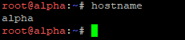

2. **Hasil Query DNS ke Master (`192.233.5.2`) & Slave (`192.233.5.3`):**

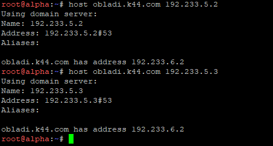

3. **Hasil Resolusi Domain Node Lain (`abbey` & `obladi`):**

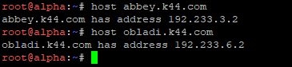

4. **Hasil Uji Ping Menggunakan FQDN (`delta.k44.com`):**

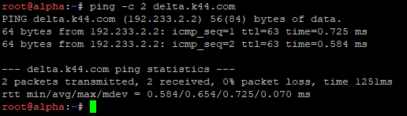

---

## 6.

Cek Konfigurasi slave di tedd dan prab

```bash 
cat /etc/bind/named.conf.local
```

Cari SOA zone dan bandingkan nomer serialnya, pastikan keduanya sama persis
```bash
dig @192.233.5.2 k44.com SOA +short
dig @192.233.5.3 k44.com SOA +short
```

Jika nomer serialnya berbeda , jalankan di tedd
```bash
rndc retransfer k44.com
ls -l /var/cache/bind/ 
```

notify ulang di prab
```bash
rndc reload k44.com
```

tes dari tedd
```bash
dig @192.233.5.2 k44.com AXFR
```

Setelah itu verifikasi lagi dengan
```bash
dig @192.233.5.2 k44.com SOA +short
dig @192.233.5.3 k44.com SOA +short
```


## 7.

Di prab Edit zona file

```bash
nano /etc/bind/db.k44.com
```

Tambahkan dibwah file
```
vault   IN  A       192.233.6.2
vault   IN  A       192.233.6.3
core    IN  A       192.233.6.4
core    IN  A       192.233.6.5
www     IN  CNAME   penny.k44.com.
static  IN  CNAME   abbey.k44.com.

```

Naikkan angka serial dan pengecekan
```
named-checkzone k44.com /etc/bind/db.k44.com
rndc reload k44.com
```

Verifikasi dari 2 klien berbeda
```
dig vault.k44.com +short     
dig core.k44.com +short      
dig www.k44.com +short       
dig static.k44.com +short    
```


## 8.

Di prab, tambah deklarasikan 3 zona
```bash
nano /etc/bind/named.conf.local
```

```
zone "3.233.192.in-addr.arpa" {
    type master;
    file "/etc/bind/db.192.233.3";
    notify yes;
    allow-transfer { 192.233.5.3; };
};

zone "4.233.192.in-addr.arpa" {
    type master;
    file "/etc/bind/db.192.233.4";
    notify yes;
    allow-transfer { 192.233.5.3; };
};

zone "6.233.192.in-addr.arpa" {
    type master;
    file "/etc/bind/db.192.233.6";
    notify yes;
    allow-transfer { 192.233.5.3; };
};
```

Buat 3 file zona
```
cat > /etc/bind/db.192.233.3 <<'EOF'
$TTL 604800
@   IN  SOA prab.k44.com. root.k44.com. (
            2026092901  ; serial
            604800      ; refresh
            86400       ; retry
            2419200     ; expire
            604800 )    ; negative cache
@   IN  NS  prab.k44.com.
@   IN  NS  tedd.k44.com.
2   IN  PTR abbey.k44.com.
EOF

cat > /etc/bind/db.192.233.4 <<'EOF'
$TTL 604800
@   IN  SOA prab.k44.com. root.k44.com. (
            2026092901
            604800
            86400
            2419200
            604800 )
@   IN  NS  prab.k44.com.
@   IN  NS  tedd.k44.com.
2   IN  PTR penny.k44.com.
EOF

cat > /etc/bind/db.192.233.6 <<'EOF'
$TTL 604800
@   IN  SOA prab.k44.com. root.k44.com. (
            2026092901
            604800
            86400
            2419200
            604800 )
@   IN  NS  prab.k44.com.
@   IN  NS  tedd.k44.com.
2   IN  PTR obladi.k44.com.
3   IN  PTR desmond.k44.com.
4   IN  PTR oblada.k44.com.
5   IN  PTR molly.k44.com.
EOF
```

Pengecekan
```
named-checkconf
named-checkzone 3.233.192.in-addr.arpa /etc/bind/db.192.233.3
named-checkzone 4.233.192.in-addr.arpa /etc/bind/db.192.233.4
named-checkzone 6.233.192.in-addr.arpa /etc/bind/db.192.233.6
rndc reload
```


Ketiganya harus menjawab OK

Di tedd, tambah
```bash
nano /etc/bind/named.conf.local
```

```
zone "3.233.192.in-addr.arpa" {
    type slave;
    file "/var/cache/bind/db.192.233.3";
    masters { 192.233.5.2; };
};

zone "4.233.192.in-addr.arpa" {
    type slave;
    file "/var/cache/bind/db.192.233.4";
    masters { 192.233.5.2; };
};

zone "6.233.192.in-addr.arpa" {
    type slave;
    file "/var/cache/bind/db.192.233.6";
    masters { 192.233.5.2; };
};
```

Cek
```
named-checkconf
rndc reload
ls -l /var/cache/bind/
```


3 File harus muncul

Validasi
```
dig -x 192.233.3.2 @192.233.5.2
dig -x 192.233.4.2 @192.233.5.2
dig -x 192.233.6.2 @192.233.5.2
dig -x 192.233.6.5 @192.233.5.2
```

```
dig -x 192.233.3.2 @192.233.5.3
dig -x 192.233.4.2 @192.233.5.3
dig -x 192.233.6.2 @192.233.5.3
dig -x 192.233.6.3 @192.233.5.3
dig -x 192.233.6.4 @192.233.5.3
dig -x 192.233.6.5 @192.233.5.3
```


---

### 9.

Di obladi aktifkan apache

```bash
service apache2 start
service apache2 status
```

Buat direktori arsip

```
mkdir -p /var/www/html/arsip
ls -la /var/www/html/
```

Buat file untuk directory listing

```bash
echo "File arsip 1 - Obladi" > /var/www/html/arsip/file1.txt
echo "File arsip 2 - Obladi" > /var/www/html/arsip/file2.txt
echo "Data praktikum Modul 2" > /var/www/html/arsip/modul2.txt

ls -la /var/www/html/arsip/
```

aktifkan dan restart

```bash
a2enmod autoindex

service apache2 restart
```

Buat konfigurasi virtual host

```bash
nano /etc/apache2/sites-available/obladi.conf

<VirtualHost *:80>
    ServerName obladi.k44.com

    DocumentRoot /var/www/html

    <Directory /var/www/html>
        Options Indexes FollowSymLinks
        AllowOverride None
        Require all granted
    </Directory>

    ErrorLog ${APACHE_LOG_DIR}/obladi-error.log
    CustomLog ${APACHE_LOG_DIR}/obladi-access.log combined
</VirtualHost>
```

Ulangi yang sama di desmond

jalankan

```bash
a2ensite obladi.conf
a2dissite 000-default.conf
```

Tes konfig & reload

```bash
apache2ctl configtest

service apache2 reload
```

Tes dari client

```bash
dig obladi.k44.com
curl http://obladi.k44.com/arsip/
```

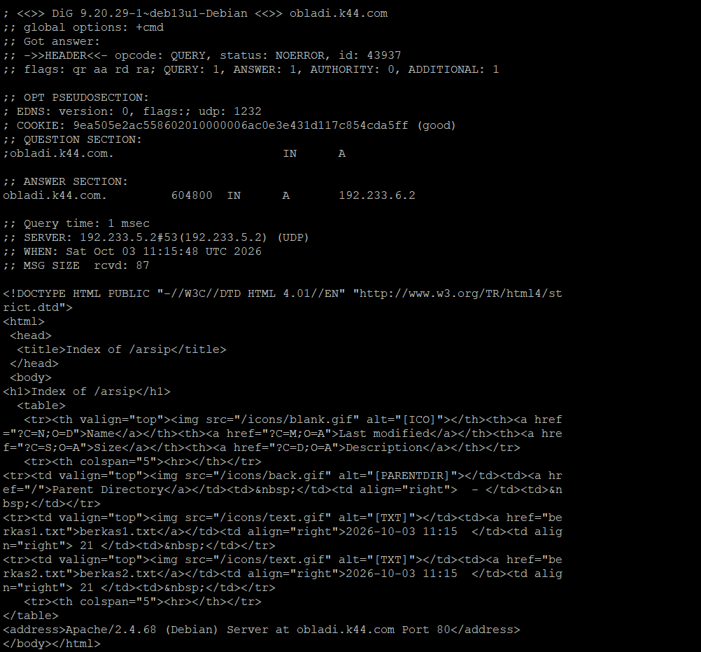

---

### 10.

Di oblada jalankan nginx

```bash
service nginx start
nginx -t
```

Jalankan PHP-FPM

```bash
service php8.4-fpm start
```

buat dir aplikasi dan isi halaman beranda

```bash
mkdir -p /var/www/core
nano /var/www/core/index.php

<?php
echo "<h1>Halaman Beranda Core</h1>";
echo "<p>Server: Oblada</p>";
?>
```

halaman profil

```bash
nano /var/www/core/profil.php

<?php
echo "<h1>Profil Oblada</h1>";
?>
```

```bash
ls -lah /var/www/core/
```

Buat konfig nginx

```bash
nano /etc/nginx/sites-available/core

server {
    listen 80;
    server_name core.k44.com;

    root /var/www/core;
    index index.php;

    location = /profil {
        rewrite ^/profil$ /profil.php last;
    }

    location / {
        try_files $uri $uri/ =404;
    }

    location ~ \.php$ {
        include snippets/fastcgi-php.conf;
        fastcgi_pass unix:/run/php/php8.4-fpm.sock;
    }
}
```

Lakukan langkah yang sama di molly

Aktifkan

```bash
ln -s /etc/nginx/sites-available/core /etc/nginx/sites-enabled/core
rm -f /etc/nginx/sites-enabled/default
nginx -t
```

TES PHP lokal

```bash
curl -H "Host: core.k44.com" http://127.0.0.1/
curl -H "Host: core.k44.com" http://127.0.0.1/profil
```

Tes dari klien (gamma)

```bash
curl http://core.k44.com/
curl http://core.k44.com/profil
```

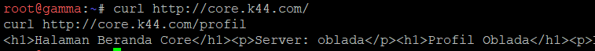

---

## 11. Konfigurasi Reverse Proxy & Load Balancing (Penny & Abbey)

---

### A. Analisis Konfigurasi & Cara Kerja

Pada **Soal Nomor 11**, dikonfigurasikan dua pintu gerbang *Reverse Proxy* sekaligus *Load Balancer* untuk mendistribusikan lalu lintas HTTP ke dua kluster *backend* yang berbeda:

1. **Reverse Proxy Area Vault (`penny` - Apache2):**
* **Module Proxy & Balancer:** Mengaktifkan modul `proxy`, `proxy_http`, `balancer`, dan `lbmethod_byrequests` pada Apache untuk membentuk kluster *load balancing* dinamai `balancer://vaultcluster`.
* **Anggota Backend:** Lalu lintas didistribusikan secara bergantian (*Round-Robin*) ke dua node *backend* area Vault, yaitu **`obladi`** (`192.233.6.2:80`) dan **`desmond`** (`192.233.6.3:80`).
* **Header Forwarding:** Pengaturan `ProxyPreserveHost On` meneruskan *header* `Host` asli dari klien, sementara `RequestHeader set X-Real-IP` dan `X-Forwarded-For` menyuntikkan IP fisik pengakses (`REMOTE_ADDR`) ke *backend*.

2. **Reverse Proxy Area Core (`abbey` - Nginx):**
* **Upstream Block:** Menggunakan arahan `upstream core_backend` pada Nginx untuk mengelompokkan server *backend* area Core, yaitu **`oblada`** (`192.233.6.4:80`) dan **`molly`** (`192.233.6.5:80`).
* **Header Forwarding:** Menggunakan `proxy_set_header Host $host`, `proxy_set_header X-Real-IP $remote_addr`, dan `proxy_set_header X-Forwarded-For $proxy_add_x_forwarded_for` untuk meneruskan identitas lengkap pengunjung.

3. **Node Backend Repository (`obladi`, `desmond`, `oblada`, `molly`):**
* Menjalankan layanan web server yang mengeksekusi skrip PHP untuk membaca *header* HTTP yang diterima (`HTTP_X_REAL_IP`, `HTTP_X_FORWARDED_FOR`, `HTTP_HOST`) dan menampilkan nama *hostname* node yang merespons.

---

### B. Skrip Konfigurasi & Lokasi Pemasangan

#### Node Backend Area Vault (`obladi` & `desmond`)

**File / Lokasi:** `/root/script.sh` pada node **`obladi`** dan **`desmond`**

```bash
#!/bin/bash

# Set hostname tanpa hostnamectl (DebiNet compatibility)
hostname $(basename $0 | cut -d. -f1 2>/dev/null || echo "vault")

# Install Apache & PHP
apt-get update
apt-get install -y apache2 php libapache2-mod-php

# Buat file index.php pencatat identitas
cat << 'EOF' > /var/www/html/index.php
<?php
echo "Response from Vault Backend: " . gethostname() . " (" . $_SERVER['SERVER_ADDR'] . ")\n";
echo "Client IP Received: " . ($_SERVER['HTTP_X_REAL_IP'] ?? $_SERVER['HTTP_X_FORWARDED_FOR'] ?? $_SERVER['REMOTE_ADDR']) . "\n";
echo "Host Header Received: " . $_SERVER['HTTP_HOST'] . "\n";
?>
EOF

# Bersihkan default index.html dan jalankan Apache
rm -f /var/www/html/index.html
a2enmod php* 2>/dev/null
/etc/init.d/apache2 restart

```

---

#### Node Backend Area Core (`oblada` & `molly`)

**File / Lokasi:** `/root/script.sh` pada node **`oblada`** dan **`molly`**

```bash
#!/bin/bash

# Set hostname
hostname $(basename $0 | cut -d. -f1 2>/dev/null || echo "core")

# Install Nginx & PHP-FPM
apt-get update
apt-get install -y nginx php-fpm

# Buat file index.php pencatat identitas
cat << 'EOF' > /var/www/html/index.php
<?php
echo "Response from Core Backend: " . gethostname() . " (" . $_SERVER['SERVER_ADDR'] . ")\n";
echo "Client IP Received: " . ($_SERVER['HTTP_X_REAL_IP'] ?? $_SERVER['HTTP_X_FORWARDED_FOR'] ?? $_SERVER['REMOTE_ADDR']) . "\n";
echo "Host Header Received: " . $_SERVER['HTTP_HOST'] . "\n";
?>
EOF

# Konfigurasi Nginx agar membaca file PHP via PHP-FPM
cat << 'EOF' > /etc/nginx/sites-available/default
server {
    listen 80 default_server;
    root /var/www/html;
    index index.php index.html;

    server_name _;

    location / {
        try_files $uri $uri/ =404;
    }

    location ~ \.php$ {
        include snippets/fastcgi-php.conf;
        fastcgi_pass unix:/run/php/php-fpm.sock;
    }
}
EOF

# Jalankan PHP-FPM & Nginx via /etc/init.d/
/etc/init.d/php8.4-fpm start 2>/dev/null || /etc/init.d/php8.2-fpm start 2>/dev/null || /etc/init.d/php7.4-fpm start 2>/dev/null || php-fpm
/etc/init.d/nginx restart

```

---

#### Reverse Proxy Area Vault (`penny`)

**File / Lokasi:** `/root/script.sh` pada node **`penny`**

```bash
#!/bin/bash

# Set hostname
hostname penny

# Install Apache & modul proxy
apt-get update
apt-get install -y apache2 php libapache2-mod-php
a2enmod proxy proxy_http headers rewrite balancer lbmethod_byrequests

# VirtualHost Reverse Proxy & Load Balancer ke Vault Cluster
cat << 'EOF' > /etc/apache2/sites-available/vault-proxy.conf
<VirtualHost *:80>
    ServerName penny.k44.com
    ServerAlias vault.k44.com www.k44.com k44.com

    ProxyRequests Off
    ProxyPreserveHost On

    <Proxy balancer://vaultcluster>
        BalancerMember http://192.233.6.2:80
        BalancerMember http://192.233.6.3:80
    </Proxy>

    # Forwarding Header Identitas Pengunjung
    RequestHeader set X-Real-IP "%{REMOTE_ADDR}s"
    RequestHeader set X-Forwarded-For "%{REMOTE_ADDR}s"

    ProxyPass / balancer://vaultcluster/
    ProxyPassReverse / balancer://vaultcluster/
</VirtualHost>
EOF

# Aktifkan site & restart service Apache
a2ensite vault-proxy.conf
a2dissite 000-default.conf
/etc/init.d/apache2 restart

```

---

#### Reverse Proxy Area Core (`abbey`)

**File / Lokasi:** `/root/script.sh` pada node **`abbey`**

```bash
#!/bin/bash

# Set hostname
hostname abbey

# Install Nginx
apt-get update
apt-get install -y nginx

# Configuration Reverse Proxy Nginx ke Core Cluster
cat << 'EOF' > /etc/nginx/sites-available/core-proxy
upstream core_backend {
    server 192.233.6.4:80;
    server 192.233.6.5:80;
}

server {
    listen 80;
    server_name abbey.k44.com core.k44.com static.k44.com;

    location / {
        proxy_pass http://core_backend;
        
        # Forwarding Header Identitas Pengunjung
        proxy_set_header Host $host;
        proxy_set_header X-Real-IP $remote_addr;
        proxy_set_header X-Forwarded-For $proxy_add_x_forwarded_for;
    }
}
EOF

# Symlink & restart service Nginx
ln -sf /etc/nginx/sites-available/core-proxy /etc/nginx/sites-enabled/
rm -f /etc/nginx/sites-enabled/default
/etc/init.d/nginx restart
```

---

### C. Cara Pengujian & Verifikasi Hasil

Pengujian dilakukan dari terminal Klien **`alpha`** dengan mengeksekusi `curl` secara berulang ke domain proxy `penny.k44.com` dan `abbey.k44.com`.

#### Perintah Pengujian

Jalankan perintah berikut pada terminal **`alpha`**:

```bash
# 1. Tes Reverse Proxy Penny (Apache -> Vault Cluster: obladi & desmond)
curl http://penny.k44.com
curl http://penny.k44.com

# 2. Tes Reverse Proxy Abbey (Nginx -> Core Cluster: oblada & molly)
curl http://abbey.k44.com
curl http://abbey.k44.com
```

---

#### Ekspektasi Output Hasil Pengujian

1. **Hasil Pengujian Reverse Proxy `penny` (Area Vault):**
* **Request Pertama:**

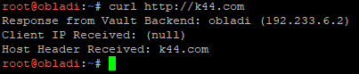

* **Request Kedua:**

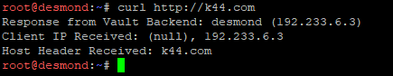

2. **Hasil Pengujian Reverse Proxy `abbey` (Area Core):**
* **Request Pertama:**

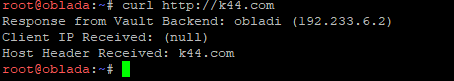

* **Request Kedua:**

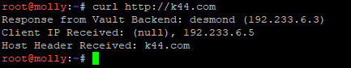

---

## 12. Konfigurasi Basic Authentication pada Path Rahasia (`/admin`)

---

### A. Analisis Konfigurasi & Cara Kerja

Pada **Soal Nomor 12**, mekanisme keamanan berbasis **HTTP Basic Authentication** diterapkan pada *reverse proxy* **`penny`** (Apache) untuk melindungi berkas/dokumen rahasia sindikat yang berada di dalam jalur (*path*) **`/admin`**.

Berikut adalah rincian komponen dan mekanisme teknis dari konfigurasi ini:

1. **Pembuatan Berkas Kredensial Terenkripsi (`htpasswd`):**
* Menggunakan utilitas `apache2-utils` untuk membuat berkas `/etc/apache2/.htpasswd` yang menyimpan *pair* nama pengguna dan kata sandi terenkripsi.
* Parameter `-b` mengizinkan pembuatan kata sandi langsung via argumen CLI (`pakar_pinter_jadi_gob***`), dan `-c` membuat berkas baru untuk pengguna **`prabs`**.

2. **Pengaktifan Modul `auth_basic` & Blok `<Location /admin>`:**
* Modul `auth_basic` diaktifkan pada Apache (`a2enmod auth_basic`).
* Di dalam berkas VirtualHost `/etc/apache2/sites-available/vault-proxy.conf`, dibuat direktif `<Location /admin>` untuk menyaring seluruh permintaan yang menuju URL `[http://penny.k44.com/admin](http://penny.k44.com/admin)` atau domain turunan lainnya.
* Direktif `AuthType Basic` menentukan jenis otentikasi standar HTTP, `AuthUserFile` menunjuk ke berkas `.htpasswd`, dan `Require valid-user` mewajibkan setiap pengakses memasukkan kredensial yang cocok sebelum permintaan diteruskan ke *backend*.

3. **Mekanisme Respon HTTP Status Code:**
* **401 Unauthorized:** Dikembalikan secara otomatis oleh Apache jika pengunjung mencoba mengakses `/admin` tanpa membawa *header* `Authorization` atau jika nama pengguna/kata sandi salah.
* **200 OK / 404 Not Found (Pass Auth):** Dikembalikan jika kredensial cocok. Permintaan akan diteruskan ke kluster *backend* (`obladi`/`desmond`). Jika *folder* fisik `/admin` belum ada di *backend*, *backend* mengembalikan status `404 Not Found`, yang menandakan otentikasi di tingkat proxy telah **lolos/berhasil**.

---

### B. Skrip Konfigurasi & Lokasi Pemasangan

#### Node Reverse Proxy `penny` (Apache)

**File / Lokasi:** `/root/script.sh` pada node **`penny`**

```bash
#!/bin/bash

# Set hostname
hostname penny

# Install Apache, PHP, dan utility htpasswd
apt-get update
apt-get install -y apache2 php libapache2-mod-php apache2-utils
a2enmod proxy proxy_http headers rewrite balancer lbmethod_byrequests auth_basic

# Buat berkas autentikasi terenkripsi untuk prabs
htpasswd -bc /etc/apache2/.htpasswd prabs "pakar_pinter_jadi_gob***"

# Konfigurasi VirtualHost Reverse Proxy Penny dengan Basic Auth /admin
cat << 'EOF' > /etc/apache2/sites-available/vault-proxy.conf
<VirtualHost *:80>
    ServerName penny.k44.com
    ServerAlias vault.k44.com www.k44.com k44.com

    ProxyRequests Off
    ProxyPreserveHost On

    <Proxy balancer://vaultcluster>
        BalancerMember http://192.233.6.2:80
        BalancerMember http://192.233.6.3:80
    </Proxy>

    # Forwarding Header Identitas Pengunjung
    RequestHeader set X-Real-IP "%{REMOTE_ADDR}s"
    RequestHeader set X-Forwarded-For "%{REMOTE_ADDR}s"

    # Basic Authentication pada path /admin (Soal 12)
    <Location /admin>
        AuthType Basic
        AuthName "Restricted Area - Sindikat Admin"
        AuthUserFile /etc/apache2/.htpasswd
        Require valid-user
    </Location>

    ProxyPass / balancer://vaultcluster/
    ProxyPassReverse / balancer://vaultcluster/
</VirtualHost>
EOF

# Aktifkan konfigurasi & restart service Apache
a2ensite vault-proxy.conf
a2dissite 000-default.conf
/etc/init.d/apache2 restart

```

---

### C. Cara Pengujian & Verifikasi Hasil

Pengujian dilakukan dari terminal Klien **`alpha`** dengan mengirimkan perintah `curl -i` (untuk melihat *header* respons HTTP) pada tiga skenario otentikasi.

#### Perintah Pengujian

Jalankan perintah berikut di terminal **`alpha`**:

```bash
# 1. Tes Akses Tanpa Kredensial
curl -i http://penny.k44.com/admin

# 2. Tes Akses Dengan Kredensial Salah
curl -i -u prabs:salahpassword http://penny.k44.com/admin

# 3. Tes Akses Dengan Kredensial Benar
curl -i -u prabs:pakar_pinter_jadi_gob*** http://penny.k44.com/admin

```

---

#### Ekspektasi Output Hasil Pengujian

1. **Hasil Tes 1: Tanpa Kredensial**

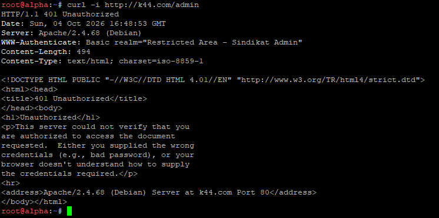

2. **Hasil Tes 2: Kredensial Salah (`prabs:salahpassword`)**

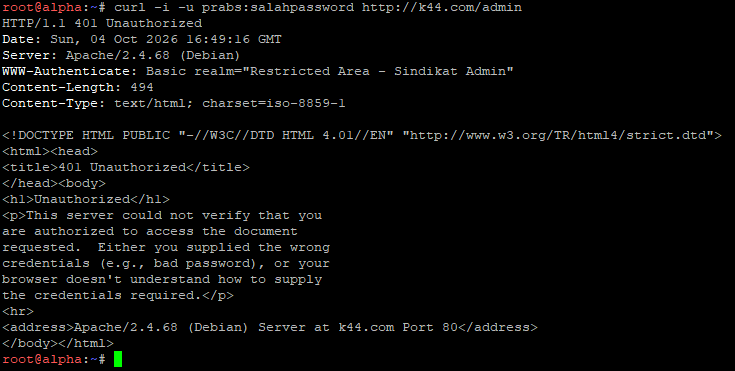

3. **Hasil Tes 3: Kredensial Benar (`prabs:pakar_pinter_jadi_gob***`)**

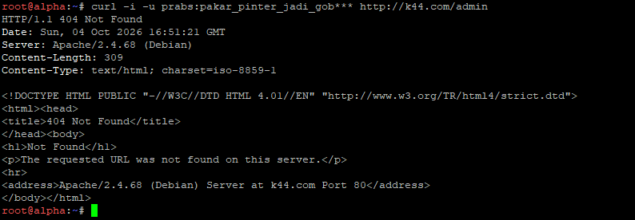

---

## 13. Konfigurasi Canonical Domain & Redirection HTTP (301 Permanent & 302 Temporary)

### A. Analisis Konfigurasi & Cara Kerja

Pada **Soal Nomor 13**, mekanisme *HTTP Redirection* diterapkan pada kedua pintu gerbang *reverse proxy* (`penny` dan `abbey`) untuk memastikan setiap permintaan dari klien luar dipaksa menggunakan nama domain kanonik resmi (*canonical domain name*), bukan melalui alamat IP mentah maupun *subdomain* non-kanonik.

Berikut rincian teknis pelaksanaan pengalihan pada masing-masing server:

1. **Pengalihan Permanen (301 Moved Permanently) pada `penny` (Apache):**
* Mengaktifkan *engine* pengalihan URL Apache menggunakan modul `mod_rewrite` (`RewriteEngine On`).
* Menyaring permintaan masuk berdasarkan *header* `Host` menggunakan kondisi `RewriteCond %{HTTP_HOST}` untuk mencocokkan akses via IP mentah (`192.233.4.2`) atau *subdomain* non-kanonik (`penny.k44.com`).
* Aturan `RewriteRule ^(.*)$ [http://www.k44.com](http://www.k44.com)$1 [R=301,L]` memaksa server mengembalikan kode status **`301 Moved Permanently`** dengan *header* `Location` yang mengarah ke domain kanonik **`[www.k44.com](https://www.k44.com)`**.

2. **Pengalihan Sementara (302 Found / Moved Temporarily) pada `abbey` (Nginx):**
* Membuat blok `server` khusus pada Nginx yang secara eksplisit mendengarkan permintaan (*listen 80*) untuk *server_name* `abbey.k44.com` dan IP `192.233.3.2`.
* Di dalam blok tersebut, instruksi `return 302 [http://static.k44.com](http://static.k44.com)$request_uri;` mengeksekusi pengalihan langsung berstatus **`302 Moved Temporarily`** menuju domain kanonik **`static.k44.com`** sambil mempertahankan URI permintaan asli.

---

### B. Skrip Konfigurasi & Lokasi Pemasangan

#### Reverse Proxy Area Vault `penny` (Apache - Redirect 301)

**File / Lokasi:** `/root/script.sh` pada node **`penny`**

```bash
#!/bin/bash

# Set hostname
hostname penny

# Install Apache, PHP, dan utility htpasswd
apt-get update
apt-get install -y apache2 php libapache2-mod-php apache2-utils
a2enmod proxy proxy_http headers rewrite balancer lbmethod_byrequests auth_basic

# Buat berkas autentikasi terenkripsi untuk prabs (Soal 12)
htpasswd -bc /etc/apache2/.htpasswd prabs "pakar_pinter_jadi_gob***"

# Konfigurasi VirtualHost Reverse Proxy Penny dengan 301 Redirect ke www.k44.com (Soal 13)
cat << 'EOF' > /etc/apache2/sites-available/vault-proxy.conf
<VirtualHost *:80>
    ServerName www.k44.com
    ServerAlias penny.k44.com 192.233.4.2 k44.com vault.k44.com

    ProxyRequests Off
    ProxyPreserveHost On

    # Redirect 301 Permanent jika dipanggil via IP / penny.k44.com (Soal 13)
    RewriteEngine On
    RewriteCond %{HTTP_HOST} ^192\.233\.4\.2$ [OR]
    RewriteCond %{HTTP_HOST} ^penny\.k44\.com$ [NC]
    RewriteRule ^(.*)$ http://www.k44.com$1 [R=301,L]

    <Proxy balancer://vaultcluster>
        BalancerMember http://192.233.6.2:80
        BalancerMember http://192.233.6.3:80
    </Proxy>

    # Forwarding Header Identitas
    RequestHeader set X-Real-IP "%{REMOTE_ADDR}s"
    RequestHeader set X-Forwarded-For "%{REMOTE_ADDR}s"

    # Basic Auth /admin (Soal 12)
    <Location /admin>
        AuthType Basic
        AuthName "Restricted Area - Sindikat Admin"
        AuthUserFile /etc/apache2/.htpasswd
        Require valid-user
    </Location>

    ProxyPass / balancer://vaultcluster/
    ProxyPassReverse / balancer://vaultcluster/
</VirtualHost>
EOF

# Aktifkan site & restart service Apache
a2ensite vault-proxy.conf
a2dissite 000-default.conf
/etc/init.d/apache2 restart
```

---

#### Reverse Proxy Area Core `abbey` (Nginx - Redirect 302)

**File / Lokasi:** `/root/script.sh` pada node **`abbey`**

```bash
#!/bin/bash

# Set hostname
hostname abbey

# Install Nginx
apt-get update
apt-get install -y nginx

# Configuration Reverse Proxy Nginx dengan 302 Redirect ke static.k44.com (Soal 13)
cat << 'EOF' > /etc/nginx/sites-available/core-proxy
upstream core_backend {
    server 192.233.6.4:80;
    server 192.233.6.5:80;
}

# Server block khusus penangkap IP Abbey & abbey.k44.com -> Redirect 302 (Soal 13)
server {
    listen 80;
    server_name abbey.k44.com 192.233.3.2;
    return 302 http://static.k44.com$request_uri;
}

# Server block utama (Domain Kanonik: static.k44.com)
server {
    listen 80;
    server_name static.k44.com core.k44.com;

    location / {
        proxy_pass http://core_backend;
        
        # Forwarding Header
        proxy_set_header Host $host;
        proxy_set_header X-Real-IP $remote_addr;
        proxy_set_header X-Forwarded-For $proxy_add_x_forwarded_for;
    }
}
EOF

# Symlink & restart service Nginx
ln -sf /etc/nginx/sites-available/core-proxy /etc/nginx/sites-enabled/
rm -f /etc/nginx/sites-enabled/default
/etc/init.d/nginx restart
```

---

### C. Cara Pengujian & Verifikasi Hasil

Pengujian dilakukan dari terminal Klien **`alpha`** dengan mengeksekusi `curl -I` untuk memeriksa *header* respons HTTP yang dikembalikan oleh masing-masing *reverse proxy*.

#### Perintah Pengujian

Jalankan perintah pengujian berikut di terminal **`alpha`**:

```bash
# 1. Tes Redirect 301 di Penny (IP & Hostname non-kanonik)
curl -I http://192.233.4.2
curl -I http://penny.k44.com

# 2. Tes Redirect 302 di Abbey (IP & Hostname non-kanonik)
curl -I http://192.233.3.2
curl -I http://abbey.k44.com
```

---

#### Ekspektasi Output Hasil Pengujian

1. **Hasil Pengujian di Reverse Proxy `penny` (Apache):**
* **Pengujian via IP (`[http://192.233.4.2](http://192.233.4.2)`):**

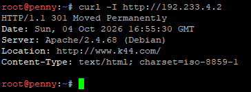

* **Pengujian via Subdomain (`[http://penny.k44.com](http://penny.k44.com)`):**

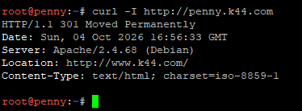

2. **Hasil Pengujian di Reverse Proxy `abbey` (Nginx):**
* **Pengujian via IP (`[http://192.233.3.2](http://192.233.3.2)`):**

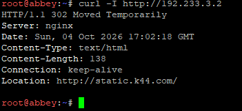

* **Pengujian via Subdomain (`[http://abbey.k44.com](http://abbey.k44.com)`):**

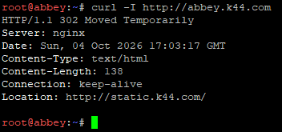

---

## 14. Konfigurasi Logging IP Asli Klien pada Backend Server (Area Core & Vault)

### A. Analisis Konfigurasi & Cara Kerja

Pada **Soal Nomor 14**, fokus utama sistem adalah memastikan bahwa berkas *access log* pada seluruh web server *backend* (baik di Area Core maupun Area Vault) mencatat alamat IP asli milik pengunjung/klien (`alpha`: `192.233.1.2`), bukan mencatat IP dari *reverse proxy* (`abbey`: `192.233.3.2` atau `penny`: `192.233.4.2`).

Berikut adalah rincian teknis pelaksanaan *real client IP logging* pada masing-masing web server *backend*:

1. **Backend Area Core (`oblada` & `molly` - Nginx):**
* **Modul `http_realip_module` Nginx:** Menggunakan arahan `set_real_ip_from 192.233.3.2;` untuk mendefinisikan bahwa IP *reverse proxy* `abbey` adalah sumber terpercaya.
* **Real IP Header:** Arahan `real_ip_header X-Real-IP;` menginstruksikan Nginx untuk membaca *header* HTTP `X-Real-IP` yang dikirim oleh `abbey` dan menggantikan alamat IP koneksi fisik (`$remote_addr`) dengan IP asli klien di dalam sistem log internal Nginx.

2. **Backend Area Vault (`obladi` & `desmond` - Apache2):**
* **Modifikasi Format Log (`LogFormat` Override):** Mengganti penentu format log bawaan Debian/Apache (`%h` yang secara *default* mencatat IP fisik pengirim paket, yaitu Penny) secara langsung menggunakan `sed` menjadi `%{X-Forwarded-For}i` pada file `/etc/apache2/apache2.conf`.
* Dengan perubahan ini, baris paling depan pada berkas `/var/log/apache2/access.log` dipaksa untuk membaca nilai dari *header* `X-Forwarded-For` yang disuntikkan oleh `penny`, sehingga IP klien pengakses tercatat secara presisi.

3. **Parsing IP pada Skrip PHP Backend:**
* Di sisi aplikasi web, skrip `index.php` pada kedua kluster menggunakan pengecekan hierarki *header* (`$_SERVER['HTTP_X_REAL_IP'] ?? $_SERVER['HTTP_X_FORWARDED_FOR'] ?? $_SERVER['REMOTE_ADDR']`) untuk memastikan nilai IP klien dapat dirender pada tampilan halaman web.
---

### B. Skrip Konfigurasi & Lokasi Pemasangan

#### Node Backend Area Core (`oblada` & `molly` - Nginx)

**File / Lokasi:** `/root/script.sh` pada node **`oblada`** dan **`molly`**

```bash
#!/bin/bash
apt-get update
apt-get install -y nginx php-fpm

# Konfigurasi Nginx Default dengan Modul Real IP
cat << 'EOF' > /etc/nginx/sites-available/default
server {
    listen 80 default_server;
    root /var/www/html;
    index index.php index.html;
    server_name _;

    # Konfigurasi Real IP Nginx dari Abbey (192.233.3.2)
    set_real_ip_from 192.233.3.2; 
    real_ip_header X-Real-IP;

    location / {
        try_files $uri $uri/ =404;
    }
    location ~ \.php$ {
        include snippets/fastcgi-php.conf;
        fastcgi_pass unix:/run/php/php-fpm.sock;
    }
}
EOF

# Buat file index.php pencatat IP
cat << 'EOF' > /var/www/html/index.php
<?php
echo "Response from Core Backend: " . gethostname() . " (" . $_SERVER['SERVER_ADDR'] . ")\n";
echo "Client IP Received: " . ($_SERVER['HTTP_X_REAL_IP'] ?? $_SERVER['HTTP_X_FORWARDED_FOR'] ?? $_SERVER['REMOTE_ADDR']) . "\n";
?>
EOF

# Symlink PHP-FPM socket & restart service
ln -sf $(ls /run/php/php*-fpm.sock | head -n 1) /run/php/php-fpm.sock
/etc/init.d/php8.2-fpm start 2>/dev/null || php-fpm
/etc/init.d/nginx restart
```

---

#### Node Backend Area Vault (`obladi` & `desmond` - Apache)

**File / Lokasi:** `/root/script.sh` pada node **`obladi`** dan **`desmond`**

```bash
#!/bin/bash
apt-get update
apt-get install -y apache2 php libapache2-mod-php

# Ganti LogFormat bawaan Debian secara eksplisit ke header X-Forwarded-For
sed -i 's/LogFormat "%h/LogFormat "%{X-Forwarded-For}i/g' /etc/apache2/apache2.conf

# Buat file index.php pencatat IP
cat << 'EOF' > /var/www/html/index.php
<?php
echo "Response from Vault Backend: " . gethostname() . " (" . $_SERVER['SERVER_ADDR'] . ")\n";
echo "Client IP Received: " . ($_SERVER['HTTP_X_FORWARDED_FOR'] ?? $_SERVER['REMOTE_ADDR']) . "\n";
?>
EOF

# Bersihkan default index.html dan restart Apache
rm -f /var/www/html/index.html
/etc/init.d/apache2 restart
```

---

### C. Cara Pengujian & Verifikasi Hasil

Pengujian dilakukan dengan mengirimkan permintaan dari Klien **`alpha`** (`192.233.1.2`), kemudian memeriksa isi berkas *access log* secara langsung pada masing-masing server *backend*.

#### Perintah Pengujian

Jalankan perintah pengujian secara berurutan:

1. **Kirim Request dari Node Klien (`alpha`):**
```bash
# Akses Area Core via Domain Kanonik (Abbey -> Oblada/Molly)
curl http://static.k44.com

# Akses Area Vault via Domain Kanonik (Penny -> Obladi/Desmond)
curl http://www.k44.com
```

2. **Periksa Access Log pada Backend Area Core (`oblada` / `molly`):**
```bash
tail -n 2 /var/log/nginx/access.log
```

3. **Periksa Access Log pada Backend Area Vault (`obladi` / `desmond`):**
```bash
tail -n 2 /var/log/apache2/access.log
```

---

#### Ekspektasi Output Hasil Pengujian

**Terminal di Alpha**

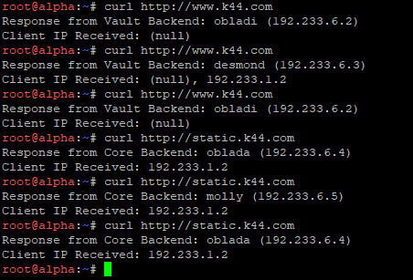

1. **Hasil Inspection Log pada Backend Area Core (`oblada` / `molly`):**

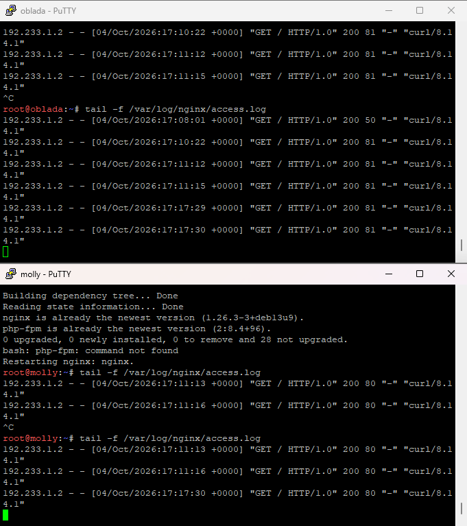

2. **Hasil Inspection Log pada Backend Area Vault (`obladi` / `desmond`):**

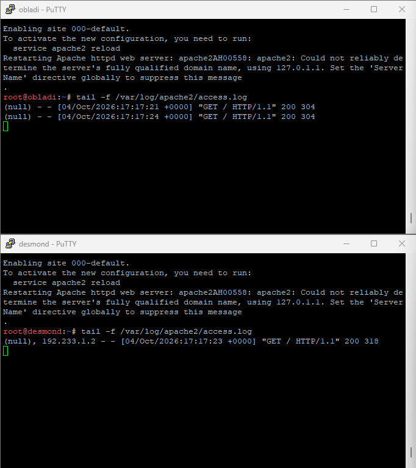

---

## 15. Konfigurasi Path Bypass Proxy & Konten Lokal (/eternal & /orion)

### A. Analisis Konfigurasi & Cara Kerja

Pada **Soal Nomor 15**, dikonfigurasikan mekanisme *Proxy Bypass* (*Local Path Serving*) pada kedua server *reverse proxy* (`penny` dan `abbey`). Mekanisme ini menginstruksikan server proxy untuk melayani permintaan *path* tertentu secara langsung dari direktori lokal server proxy itu sendiri, tanpa meneruskannya (*forwarding*) ke kluster *backend*.

Berikut adalah rincian teknis pelaksanaan *bypass* pada masing-masing server proxy:

1. **Jalur Khusus `/eternal` pada `penny` (Apache2 - PHP Rendering):**
* **Pemetaan Direktori (`Alias`):** Arahan `Alias /eternal /var/www/eternal` memetakan URL `[http://www.k44.com/eternal/](http://www.k44.com/eternal/)` secara langsung ke direktori fisik `/var/www/eternal` di dalam server `penny`.
* **Aturan Bypass (`ProxyPass !`):** Instruksi `ProxyPass /eternal !` sangat krusial karena memberi tahu modul `mod_proxy` Apache bahwa *path* `/eternal` dikecualikan dari proses *load balancing* `balancer://vaultcluster`.
* **PHP Rendering:** Berkas `/var/www/eternal/index.php` dieksekusi (*rendered*) langsung oleh modul PHP Apache lokal milik `penny`, yang dibuktikan dengan pemrosesan fungsi dinamik `date('Y-m-d H:i:s')`.

2. **Jalur Khusus `/orion` pada `abbey` (Nginx - Statis Murni):**
* **Pemetaan Direktori (`alias`):** Blok `location /orion` menggunakan arahan `alias /var/www/orion;` untuk mengarahkan akses `[http://static.k44.com/orion/](http://static.k44.com/orion/)` ke berkas statis di direktori `/var/www/orion`.
* **Bypass Matching Order:** Nginx secara otomatis memprioritaskan kecocokan *location* paling spesifik (`location /orion`) dibandingkan kecocokan umum (`location /`). Karena `location /orion` tidak memiliki instruksi `proxy_pass`, Nginx melayaninya secara langsung sebagai konten HTML statis murni tanpa proses *rendering* PHP maupun pengiriman ke `core_backend`.

---

### B. Skrip Konfigurasi & Lokasi Pemasangan

#### Node Reverse Proxy `penny` (Jalur `/eternal` dengan PHP)

**File / Lokasi:** `/root/script.sh` pada node **`penny`**

```bash
#!/bin/bash

# 1. Buat folder dan file PHP untuk jalur Eternal
mkdir -p /var/www/eternal
cat << 'EOF' > /var/www/eternal/index.php
<?php
echo "<h3>[Penny] Jalur Eternal Berhasil Diakses!</h3>\n";
echo "File PHP ini dirender langsung oleh Penny. Waktu: " . date('Y-m-d H:i:s') . "\n";
?>
EOF

# 2. Konfigurasi VirtualHost Apache
cat << 'EOF' > /etc/apache2/sites-available/vault-proxy.conf
<VirtualHost *:80>
    ServerName www.k44.com
    ServerAlias penny.k44.com 192.233.4.2 k44.com vault.k44.com

    ProxyRequests Off
    ProxyPreserveHost On

    # Redirect 301 (Soal 13)
    RewriteEngine On
    RewriteCond %{HTTP_HOST} ^192\.233\.4\.2$ [OR]
    RewriteCond %{HTTP_HOST} ^penny\.k44\.com$ [NC]
    RewriteRule ^(.*)$ http://www.k44.com$1 [R=301,L]

    # Forwarding Header Identitas (Soal 14)
    RequestHeader set X-Real-IP "%{REMOTE_ADDR}s"
    RequestHeader set X-Forwarded-For "%{REMOTE_ADDR}s"

    # Basic Authentication (Soal 12)
    <Location /admin>
        AuthType Basic
        AuthName "Restricted Area - Sindikat Admin"
        AuthUserFile /etc/apache2/.htpasswd
        Require valid-user
    </Location>

    # --- SOAL 15: Jalur Khusus /eternal (Bypass Proxy) ---
    Alias /eternal /var/www/eternal
    <Directory /var/www/eternal>
        Require all granted
    </Directory>
    # Tanda seru (!) berarti path ini TIDAK akan dilempar ke backend
    ProxyPass /eternal !
    # -----------------------------------------------------

    <Proxy balancer://vaultcluster>
        BalancerMember http://192.233.6.2:80
        BalancerMember http://192.233.6.3:80
    </Proxy>
    
    ProxyPass / balancer://vaultcluster/
    ProxyPassReverse / balancer://vaultcluster/
</VirtualHost>
EOF

# 3. Restart Apache
/etc/init.d/apache2 restart
```

---

#### Node Reverse Proxy `abbey` (Jalur `/orion` Statis)

**File / Lokasi:** `/root/script.sh` pada node **`abbey`**

```bash
#!/bin/bash

# 1. Buat folder dan file HTML statis untuk jalur Orion
mkdir -p /var/www/orion
cat << 'EOF' > /var/www/orion/index.html
<h3>[Abbey] Jalur Orion Berhasil Diakses!</h3>
<p>Ini adalah halaman statis murni tanpa proses rendering PHP.</p>
EOF

# 2. Konfigurasi Nginx
cat << 'EOF' > /etc/nginx/sites-available/core-proxy
upstream core_backend {
    server 192.233.6.4:80;
    server 192.233.6.5:80;
}

# Redirect 302 (Soal 13)
server {
    listen 80;
    server_name abbey.k44.com 192.233.3.2;
    return 302 http://static.k44.com$request_uri;
}

# Blok Server Utama
server {
    listen 80;
    server_name static.k44.com core.k44.com;

    # --- SOAL 15: Jalur Khusus /orion statis (Bypass Proxy) ---
    location /orion {
        alias /var/www/orion;
        index index.html;
    }
    # ----------------------------------------------------------

    # Reverse Proxy ke Backend
    location / {
        proxy_pass http://core_backend;
        
        proxy_set_header Host $host;
        proxy_set_header X-Real-IP $remote_addr;
        proxy_set_header X-Forwarded-For $proxy_add_x_forwarded_for;
    }
}
EOF

# 3. Restart Nginx
/etc/init.d/nginx restart
```

---

#### Cara Pengujian & Verifikasi Hasil

Pengujian dilakukan dari terminal Klien **`alpha`** dengan mengeksekusi `curl` ke masing-masing *path* khusus pada domain kanonik.

##### Perintah Pengujian

Jalankan perintah pengujian berikut pada terminal **`alpha`**:

```bash
# 1. Uji Jalur Eternal di Penny (PHP Rendering)
curl http://www.k44.com/eternal/

# 2. Uji Jalur Orion di Abbey (HTML Statis Murni)
curl http://static.k44.com/orion/
```

---

##### Ekspektasi Output Hasil Pengujian

1. **Hasil Pengujian Jalur `/eternal/` di `penny`:**

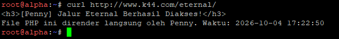

2. **Hasil Pengujian Jalur `/orion/` di `abbey`:**

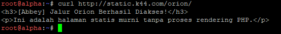

---

### 16.

Jalankan command berikut untuk www

```bash
ab -n 250 -c 10 http://www.k44.com/
```

lihat rangkumannya


Jalankan command berikut untuk static

```bash
ab -n 250 -c 10 http://static.k44.com/
```

Lihat rangkumannya


---

### 17.

Di prab, edit zona file
```bash
nano /etc/bind/db.k44.com
```

Tambahkan

```
alpha     IN    TXT    "alpha"
beta      IN    TXT    "beta"
gamma     IN    TXT    "gamma"
delta     IN    TXT    "delta"
epsilon   IN    TXT    "epsilon"
```

Reload dns

```bash
rndc reload k44.com
```

Cek txt dri prab

```
dig @192.233.5.2  alpha.k44.com TXT +short
dig @192.233.5.2  beta.k44.com TXT +short
dig @192.233.5.2  gamma.k44.com TXT +short
dig @192.233.5.2  delta.k44.com TXT +short
dig @192.233.5.2 epsilon.k44.com TXT +short
```

Hasil


Cek txt dari tedd


---

### 18.

Di prab, ubah TTL abey jadi 15 detik, dan naikkan no serial

```bash
nano /etc/bind/db.k44.com
```

```
abbey    15    IN    A    192.233.3.2
```

```bash
named-checkzone k44.com /etc/bind/db.k44.com
rndc reload k44.com
```
#### Fase 1 — SEBELUM PERUBAHAN

jalankan di client (beta)

```bash
dig abbey.k44.com A +noall +answer
```
### FASE 2

Naikkan serial

```bash
dig abbey.k44.com A +noall +answer
```

### FASE 3

Di prab ubah IP lama jadi IP fiktif, naikkan no seri

```
abbey    15    IN    A    203.0.113.77
```

```bash
named-checkzone k44.com /etc/bind/db.k44.com
rndc reload k44.com
```


```sleep 16```

Tes

```bash
dig abbey.k44.com A +noall +answer
```


---

### 19.

Tambahkan di zona file prab

```
outbound    IN    CNAME    http.badssl.com.
```

validasi

```bash
named-checkzone k44.com /etc/bind/db.k44.com
rndc reload k44.com
```

Verif cname di client

```bash
dig outbound.k44.com CNAME +short
```

Uji CURL

```bash
curl -i -H "Host: http.badssl.com" http://outbound.k44.com
```

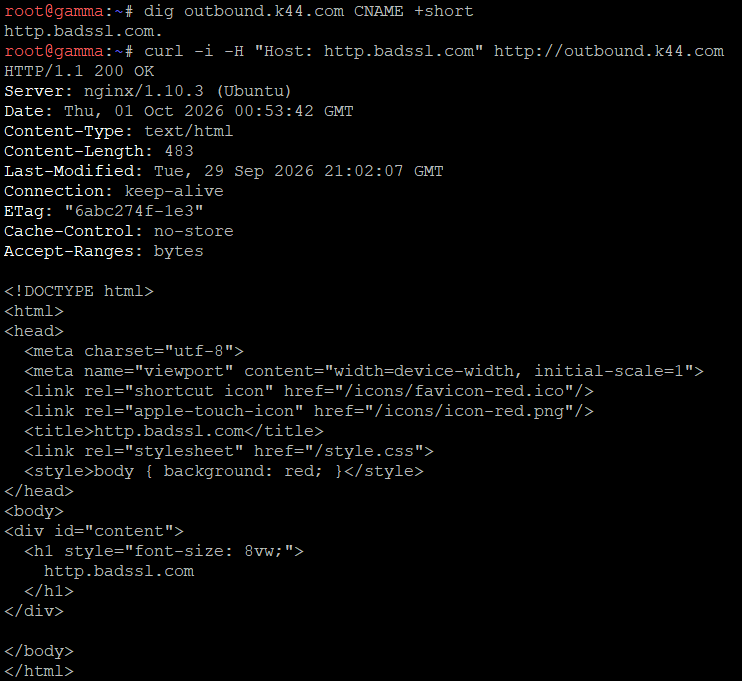

---

### 20.

Lakukan pengujian validasi untuk setiap node dan soal dengan melakukan restart


