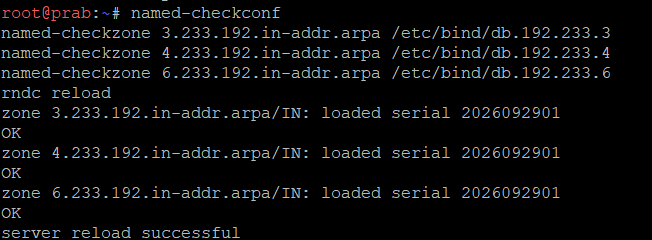
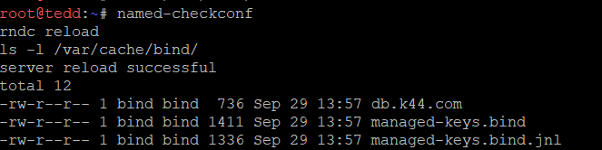

# Skrip Jarkom Modul 2

## 1. Topologi dan Config
rootkit
```bash
# NAT WAN (eth0)
auto eth0
iface eth0 inet dhcp

# Switch 6 (Klien Sayap Kiri: Alpha, Beta, Gamma)
auto eth1
iface eth1 inet static
    address 192.233.1.1
    netmask 255.255.255.0

# Switch 7 (Klien Sayap Kanan: Delta, Epsilon)
auto eth2
iface eth2 inet static
    address 192.233.2.1
    netmask 255.255.255.0

# Switch 4 (Reverse Proxy Abbey)
auto eth3
iface eth3 inet static
    address 192.233.3.1
    netmask 255.255.255.0

# Switch 5 (Reverse Proxy Penny)
auto eth4
iface eth4 inet static
    address 192.233.4.1
    netmask 255.255.255.0

# Switch 1 -> Switch 2 (DNS Prab & Tedd)
auto eth5
iface eth5 inet static
    address 192.233.5.1
    netmask 255.255.255.0

# Switch 1 -> Switch 3 (Area Vault & Core)
auto eth5:0
iface eth5:0 inet static
    address 192.233.6.1
    netmask 255.255.255.0
```

alpha
```bash
auto eth0
iface eth0 inet static
    address 192.233.1.2
    netmask 255.255.255.0
    gateway 192.233.1.1
```

beta
```bash
auto eth0
iface eth0 inet static
    address 192.233.1.3
    netmask 255.255.255.0
    gateway 192.233.1.1
```

gamma
```bash
auto eth0
iface eth0 inet static
    address 192.233.1.4
    netmask 255.255.255.0
    gateway 192.233.1.1
```

delta
```bash
auto eth0
iface eth0 inet static
    address 192.233.2.2
    netmask 255.255.255.0
    gateway 192.233.2.1
```

epsilon
```bash
auto eth0
iface eth0 inet static
    address 192.233.2.3
    netmask 255.255.255.0
    gateway 192.233.2.1
```

abbey
```bash
auto eth0
iface eth0 inet static
    address 192.233.3.2
    netmask 255.255.255.0
    gateway 192.233.3.1
```

penny
```bash
auto eth0
iface eth0 inet static
    address 192.233.4.2
    netmask 255.255.255.0
    gateway 192.233.4.1
```

prab
```bash
auto eth0
iface eth0 inet static
    address 192.233.5.2
    netmask 255.255.255.0
    gateway 192.233.5.1
```

tedd
```bash
auto eth0
iface eth0 inet static
    address 192.233.5.3
    netmask 255.255.255.0
    gateway 192.233.5.1
```

obladi
```bash
auto eth0
iface eth0 inet static
    address 192.233.6.2
    netmask 255.255.255.0
    gateway 192.233.6.1
```

desmond
```bash
auto eth0
iface eth0 inet static
    address 192.233.6.3
    netmask 255.255.255.0
    gateway 192.233.6.1
```

oblada
```bash
auto eth0
iface eth0 inet static
    address 192.233.6.4
    netmask 255.255.255.0
    gateway 192.233.6.1
```

molly
```bash
auto eth0
iface eth0 inet static
    address 192.233.6.5
    netmask 255.255.255.0
    gateway 192.233.6.1
```

## 2. Semua bisa internetan
### rootkit
Interface
```bash
# WAN Interface (Terhubung ke NAT1)
auto eth0
iface eth0 inet dhcp
    # Menjalankan skrip IP Forwarding & NAT otomatis saat interface aktif
    post-up bash /root/script.sh

# Switch 6 (Alpha, Beta, Gamma)
auto eth1
iface eth1 inet static
    address 192.233.1.1
    netmask 255.255.255.0

# Switch 7 (Delta, Epsilon)
auto eth2
iface eth2 inet static
    address 192.233.2.1
    netmask 255.255.255.0

# Switch 4 (Abbey)
auto eth3
iface eth3 inet static
    address 192.233.3.1
    netmask 255.255.255.0

# Switch 5 (Penny)
auto eth4
iface eth4 inet static
    address 192.233.4.1
    netmask 255.255.255.0

# Switch 1 -> Switch 2 (Prab, Tedd)
auto eth5
iface eth5 inet static
    address 192.233.5.1
    netmask 255.255.255.0

# Switch 1 -> Switch 3 (Obladi, Desmond, Oblada, Molly)
auto eth5:0
iface eth5:0 inet static
    address 192.233.6.1
    netmask 255.255.255.0
```

Terminal
```bash
#!/bin/bash

# 1. Mengaktifkan IP Forwarding di tingkat kernel Linux
sysctl -w net.ipv4.ip_forward=1

# 2. Membersihkan aturan NAT lama (opsional untuk reset)
iptables -t nat -F

# 3. Mengaktifkan MASQUERADE pada interface WAN (eth0 yang terhubung ke NAT)
iptables -t nat -A POSTROUTING -o eth0 -j MASQUERADE
```

tes di alpha dan prab
```bash
ping -c 4 8.8.8.8
```

## 3. Connect semua node dan install tools
### Interface
alpha
```bash
auto eth0
iface eth0 inet static
    address 192.233.1.2
    netmask 255.255.255.0
    gateway 192.233.1.1

    dns-nameservers 192.168.122.1

	up echo "nameserver 192.168.122.1" > /etc/resolv.conf
	up echo "nameserver 8.8.8.8" >> /etc/resolv.conf

    post-up bash /root/script.sh
```

beta
```bash
auto eth0
iface eth0 inet static
    address 192.233.1.3
    netmask 255.255.255.0
    gateway 192.233.1.1

    dns-nameservers 192.168.122.1

	up echo "nameserver 192.168.122.1" > /etc/resolv.conf
	up echo "nameserver 8.8.8.8" >> /etc/resolv.conf

    post-up bash /root/script.sh
```

gamma
```bash
auto eth0
iface eth0 inet static
    address 192.233.1.4
    netmask 255.255.255.0
    gateway 192.233.1.1

    dns-nameservers 192.168.122.1

    up echo "nameserver 192.168.122.1" > /etc/resolv.conf
	up echo "nameserver 8.8.8.8" >> /etc/resolv.conf

    post-up bash /root/script.sh
```

delta
```bash
auto eth0
iface eth0 inet static
    address 192.233.2.2
    netmask 255.255.255.0
    gateway 192.233.2.1

    dns-nameservers 192.168.122.1

    up echo "nameserver 192.168.122.1" > /etc/resolv.conf
	up echo "nameserver 8.8.8.8" >> /etc/resolv.conf

    post-up bash /root/script.sh
```

epsilon
```bash
auto eth0
iface eth0 inet static
    address 192.233.2.3
    netmask 255.255.255.0
    gateway 192.233.2.1

    dns-nameservers 192.168.122.1

    up echo "nameserver 192.168.122.1" > /etc/resolv.conf
	up echo "nameserver 8.8.8.8" >> /etc/resolv.conf

    post-up bash /root/script.sh
```

abbey
```bash
auto eth0
iface eth0 inet static
    address 192.233.3.2
    netmask 255.255.255.0
    gateway 192.233.3.1

    dns-nameservers 192.168.122.1

    up echo "nameserver 192.168.122.1" > /etc/resolv.conf
	up echo "nameserver 8.8.8.8" >> /etc/resolv.conf

    post-up bash /root/script.sh
```

penny
```bash
auto eth0
iface eth0 inet static
    address 192.233.4.2
    netmask 255.255.255.0
    gateway 192.233.4.1

    dns-nameservers 192.168.122.1

    up echo "nameserver 192.168.122.1" > /etc/resolv.conf
	up echo "nameserver 8.8.8.8" >> /etc/resolv.conf

    post-up bash /root/script.sh
```

prab
```bash
auto eth0
iface eth0 inet static
    address 192.233.5.2
    netmask 255.255.255.0
    gateway 192.233.5.1

    dns-nameservers 192.168.122.1

    up echo "nameserver 192.168.122.1" > /etc/resolv.conf
	up echo "nameserver 8.8.8.8" >> /etc/resolv.conf

    post-up bash /root/script.sh
```

tedd
```bash
auto eth0
iface eth0 inet static
    address 192.233.5.3
    netmask 255.255.255.0
    gateway 192.233.5.1

    dns-nameservers 192.168.122.1

    up echo "nameserver 192.168.122.1" > /etc/resolv.conf
	up echo "nameserver 8.8.8.8" >> /etc/resolv.conf

    post-up bash /root/script.sh
```

obladi
```bash
auto eth0
iface eth0 inet static
    address 192.233.6.2
    netmask 255.255.255.0
    gateway 192.233.6.1

    dns-nameservers 192.168.122.1

    up echo "nameserver 192.168.122.1" > /etc/resolv.conf
	up echo "nameserver 8.8.8.8" >> /etc/resolv.conf

    post-up bash /root/script.sh
```

desmond
```bash
auto eth0
iface eth0 inet static
    address 192.233.6.3
    netmask 255.255.255.0
    gateway 192.233.6.1

    dns-nameservers 192.168.122.1

    up echo "nameserver 192.168.122.1" > /etc/resolv.conf
	up echo "nameserver 8.8.8.8" >> /etc/resolv.conf

    post-up bash /root/script.sh
```

oblada
```bash
auto eth0
iface eth0 inet static
    address 192.233.6.4
    netmask 255.255.255.0
    gateway 192.233.6.1

    dns-nameservers 192.168.122.1

    up echo "nameserver 192.168.122.1" > /etc/resolv.conf
	up echo "nameserver 8.8.8.8" >> /etc/resolv.conf

    post-up bash /root/script.sh
```

molly
```bash
auto eth0
iface eth0 inet static
    address 192.233.6.5
    netmask 255.255.255.0
    gateway 192.233.6.1

    dns-nameservers 192.168.122.1

    up echo "nameserver 192.168.122.1" > /etc/resolv.conf
	up echo "nameserver 8.8.8.8" >> /etc/resolv.conf

    post-up bash /root/script.sh
```

### Test
coba di alpha dan obladi
```bash
ping -c 2 192.233.6.2

ping -c 2 deb.debian.org
```

### /root/script.sh
client sayap kiri dan kanan
```bash
#!/bin/bash

apt-get update
apt-get install -y dnsutils curl apache2-utils
```

prab <-- (Master)
```bash
#!/bin/bash

apt-get update
apt-get install -y bind9 bind9utils
```

tedd <-- (Slave)
```bash
#!/bin/bash

apt-get update
apt-get install -y bind9
```

abbey
```bash
#!/bin/bash

apt-get update
apt-get install -y nginx
```

penny
```bash
#!/bin/bash

apt-get update
apt-get install -y apache2 php libapache2-mod-php
a2enmod proxy proxy_http headers rewrite auth_basic
```

obladi & desmond
```bash
#!/bin/bash

apt-get update
apt-get install -y apache2
```

oblada & molly
```bash
#!/bin/bash

apt-get update
apt-get install -y nginx php-fpm
```

## 4. Prab x Tedd & K44.com
### script.sh
prab
```bash
# A. Set Forwarders ke NAT Gateway
cat << 'EOF' > /etc/bind/named.conf.options
options {
    directory "/var/cache/bind";
    forwarders {
        192.168.122.1;
    };
    allow-query { any; };
    auth-nxdomain no;
    listen-on-v6 { any; };
};
EOF

# B. Deklarasi Zone Master k44.com
cat << 'EOF' > /etc/bind/named.conf.local
zone "k44.com" {
    type master;
    file "/etc/bind/db.k44.com";
    allow-transfer { 192.233.5.3; }; # IP Tedd
    also-notify { 192.233.5.3; };    # Notify ke Tedd
};
EOF

# C. Buat File Database Zone db.k44.com
cat << 'EOF' > /etc/bind/db.k44.com
$TTL    604800
@       IN      SOA     prab.k44.com. admin.k44.com. (
                              2026092901 ; Serial
                                  604800 ; Refresh
                                   86400 ; Retry
                                 2419200 ; Expire
                                  604800 ) ; TTL
;
@       IN      NS      prab.k44.com.
@       IN      NS      tedd.k44.com.

; Apex domain k44.com mengarah ke IP Penny (192.233.4.2)
@       IN      A       192.233.4.2

; A record Name Server
prab    IN      A       192.233.5.2
tedd    IN      A       192.233.5.3
EOF

# D. Check Syntax & Restart Service
named-checkconf
named-checkzone k44.com /etc/bind/db.k44.com

named -u bind
rndc reload
```

tedd
```bash
# A. Deklarasi Zone Slave k44.com
cat << 'EOF' > /etc/bind/named.conf.local
zone "k44.com" {
    type slave;
    file "/var/cache/bind/db.k44.com";
    masters { 192.233.5.2; }; # IP Prab
};
EOF

# B. Check Syntax & Restart Service
named-checkconf

named -u bind
rndc reload
```
### interface
semua non-router
```bash
auto eth0
iface eth0 inet static
	address <ip address>
	netmask 255.255.255.0
	gateway <ip address>

	dns-nameservers 192.233.5.2 192.233.5.3 192.168.122.1

	# Auto-run resolv.conf
	up echo -e "nameserver 192.233.5.2\nnameserver 192.233.5.3\nnameserver 192.168.122.1" > /etc/resolv.conf
	up echo "nameserver 8.8.8.8" >> /etc/resolv.conf 

	# Auto-run skrip saat interface up
	post-up bash /root/script.sh
```

### tes
Di alpha
```bash
# 1. Tes query Apex Domain k44.com (Harus menjawab IP Penny: 192.233.4.2)
dig @192.233.5.2 k44.com +short
dig @192.233.5.3 k44.com +short

# 2. Tes query Hostname prab dan tedd
host prab.k44.com
host tedd.k44.com

# 3. Tes Ping Apex Domain
ping -c 2 k44.com
```

## 5. 
### Set host name
rootkit: hostnamectl set-hostname rootkit
alpha: hostnamectl set-hostname alpha
beta: hostnamectl set-hostname beta
gamma: hostnamectl set-hostname gamma
delta: hostnamectl set-hostname delta
epsilon: hostnamectl set-hostname epsilon
prab: hostnamectl set-hostname prab
tedd: hostnamectl set-hostname tedd
abbey: hostnamectl set-hostname abbey
penny: hostnamectl set-hostname penny
obladi: hostnamectl set-hostname obladi
desmond: hostnamectl set-hostname desmond
oblada: hostnamectl set-hostname oblada
molly: hostnamectl set-hostname molly

### script.sh
prab
```bash
cat << 'EOF' > /etc/bind/db.k44.com
$TTL    604800
@       IN      SOA     prab.k44.com. admin.k44.com. (
                              2026092902 ; Serial
                                  604800 ; Refresh
                                   86400 ; Retry
                                 2419200 ; Expire
                                  604800 ) ; TTL
;
@       IN      NS      prab.k44.com.
@       IN      NS      tedd.k44.com.

; Apex domain k44.com mengarah ke IP Penny
@       IN      A       192.233.4.2

; NS Nodes (Pengecualian: Dibuat di Soal 4)
prab    IN      A       192.233.5.2
tedd    IN      A       192.233.5.3

; Klien Sayap Kiri & Kanan
alpha   IN      A       192.233.1.2
beta    IN      A       192.233.1.3
gamma   IN      A       192.233.1.4
delta   IN      A       192.233.2.2
epsilon IN      A       192.233.2.3

; Reverse Proxies
abbey   IN      A       192.233.3.2
penny   IN      A       192.233.4.2

; Area Vault (Statis)
obladi  IN      A       192.233.6.2
desmond IN      A       192.233.6.3

; Area Core (Dinamis)
oblada  IN      A       192.233.6.4
molly   IN      A       192.233.6.5
EOF

# Check Syntax & Reload Service
named-checkzone k44.com /etc/bind/db.k44.com
rndc reload k44.com
rndc notify k44.com
```

tedd
```bash
rm -f /var/cache/bind/db.k44.com
pkill named
named -u bind
rndc reload
```

## Tes
node lain
```bash
# Uji Hostname System-Wide
hostname

# Uji Query DNS Master & Slave
host obladi.k44.com 192.233.5.2
host obladi.k44.com 192.233.5.3

# Uji Query Domain Node Lain
host abbey.k44.com
host obladi.k44.com
ping -c 2 delta.k44.com
```

## 6.

Cek Konfigurasi slave di tedd dan prab

```bash 
cat /etc/bind/named.conf.local
```

Cari SOA zone dan bandingkan nomer serialnya, pastikan keduanya sama persis
```bash
dig @192.233.5.2 k44.com SOA +short
dig @192.233.5.3 k44.com SOA +short
```

Jika nomer serialnya berbeda , jalankan di tedd
```bash
rndc retransfer k44.com
ls -l /var/cache/bind/ 
```

notify ulang di prab
```bash
rndc reload k44.com
```

tes dari tedd
```bash
dig @192.233.5.2 k44.com AXFR
```

Setelah itu verifikasi lagi dengan
```bash
dig @192.233.5.2 k44.com SOA +short
dig @192.233.5.3 k44.com SOA +short
```


## 7.

Di prab Edit zona file

```bash
nano /etc/bind/db.k44.com
```

Tambahkan dibwah file
```
vault   IN  A       192.233.6.2
vault   IN  A       192.233.6.3
core    IN  A       192.233.6.4
core    IN  A       192.233.6.5
www     IN  CNAME   penny.k44.com.
static  IN  CNAME   abbey.k44.com.

```

Naikkan angka serial dan pengecekan
```
named-checkzone k44.com /etc/bind/db.k44.com
rndc reload k44.com
```

Verifikasi dari 2 klien berbeda
```
dig vault.k44.com +short     
dig core.k44.com +short      
dig www.k44.com +short       
dig static.k44.com +short    
```


## 8.

Di prab, tambah deklarasikan 3 zona
```bash
nano /etc/bind/named.conf.local
```

```
zone "3.233.192.in-addr.arpa" {
    type master;
    file "/etc/bind/db.192.233.3";
    notify yes;
    allow-transfer { 192.233.5.3; };
};

zone "4.233.192.in-addr.arpa" {
    type master;
    file "/etc/bind/db.192.233.4";
    notify yes;
    allow-transfer { 192.233.5.3; };
};

zone "6.233.192.in-addr.arpa" {
    type master;
    file "/etc/bind/db.192.233.6";
    notify yes;
    allow-transfer { 192.233.5.3; };
};
```

Buat 3 file zona
```
cat > /etc/bind/db.192.233.3 <<'EOF'
$TTL 604800
@   IN  SOA prab.k44.com. root.k44.com. (
            2026092901  ; serial
            604800      ; refresh
            86400       ; retry
            2419200     ; expire
            604800 )    ; negative cache
@   IN  NS  prab.k44.com.
@   IN  NS  tedd.k44.com.
2   IN  PTR abbey.k44.com.
EOF

cat > /etc/bind/db.192.233.4 <<'EOF'
$TTL 604800
@   IN  SOA prab.k44.com. root.k44.com. (
            2026092901
            604800
            86400
            2419200
            604800 )
@   IN  NS  prab.k44.com.
@   IN  NS  tedd.k44.com.
2   IN  PTR penny.k44.com.
EOF

cat > /etc/bind/db.192.233.6 <<'EOF'
$TTL 604800
@   IN  SOA prab.k44.com. root.k44.com. (
            2026092901
            604800
            86400
            2419200
            604800 )
@   IN  NS  prab.k44.com.
@   IN  NS  tedd.k44.com.
2   IN  PTR obladi.k44.com.
3   IN  PTR desmond.k44.com.
4   IN  PTR oblada.k44.com.
5   IN  PTR molly.k44.com.
EOF
```

Pengecekan
```
named-checkconf
named-checkzone 3.233.192.in-addr.arpa /etc/bind/db.192.233.3
named-checkzone 4.233.192.in-addr.arpa /etc/bind/db.192.233.4
named-checkzone 6.233.192.in-addr.arpa /etc/bind/db.192.233.6
rndc reload
```



Ketiganya harus menjawab OK

Di tedd, tambah
```bash
nano /etc/bind/named.conf.local
```

```
zone "3.233.192.in-addr.arpa" {
    type slave;
    file "/var/cache/bind/db.192.233.3";
    masters { 192.233.5.2; };
};

zone "4.233.192.in-addr.arpa" {
    type slave;
    file "/var/cache/bind/db.192.233.4";
    masters { 192.233.5.2; };
};

zone "6.233.192.in-addr.arpa" {
    type slave;
    file "/var/cache/bind/db.192.233.6";
    masters { 192.233.5.2; };
};
```

Cek
```
named-checkconf
rndc reload
ls -l /var/cache/bind/
```


3 File harus muncul

Validasi
```
dig -x 192.233.3.2 @192.233.5.2
dig -x 192.233.4.2 @192.233.5.2
dig -x 192.233.6.2 @192.233.5.2
dig -x 192.233.6.5 @192.233.5.2
```

```
dig -x 192.233.3.2 @192.233.5.3
dig -x 192.233.4.2 @192.233.5.3
dig -x 192.233.6.2 @192.233.5.3
dig -x 192.233.6.3 @192.233.5.3
dig -x 192.233.6.4 @192.233.5.3
dig -x 192.233.6.5 @192.233.5.3
```


---

Berikut adalah ringkasan lengkap skrip, lokasi pemasangan, dan cara pengujian untuk seluruh rangkaian tugas dari **Nomor 11 sampai Nomor 15**.

---

## 📋 Rekapitulasi Skrip & Pengujian (Nomor 11 – 15)

### 1. Soal Nomor 11: Setup Reverse Proxy & Load Balancer

* **Lokasi Pemasangan & Skrip:**
* **Backend Vault (`obladi` & `desmond`)** $\rightarrow$ File `/root/script.sh`:


```bash
#!/bin/bash
hostname $(basename $0 | cut -d. -f1 2>/dev/null || echo "vault")
apt-get update && apt-get install -y apache2 php libapache2-mod-php
cat << 'EOF' > /var/www/html/index.php
<?php
echo "Response from Vault Backend: " . gethostname() . " (" . $_SERVER['SERVER_ADDR'] . ")\n";
echo "Client IP Received: " . ($_SERVER['HTTP_X_REAL_IP'] ?? $_SERVER['HTTP_X_FORWARDED_FOR'] ?? $_SERVER['REMOTE_ADDR']) . "\n";
echo "Host Header Received: " . $_SERVER['HTTP_HOST'] . "\n";
?>
EOF
rm -f /var/www/html/index.html
a2enmod php* 2>/dev/null
/etc/init.d/apache2 restart

```


* **Backend Core (`oblada` & `molly`)** $\rightarrow$ File `/root/script.sh`:


```bash
#!/bin/bash
hostname $(basename $0 | cut -d. -f1 2>/dev/null || echo "core")
apt-get update && apt-get install -y nginx php-fpm
cat << 'EOF' > /var/www/html/index.php
<?php
echo "Response from Core Backend: " . gethostname() . " (" . $_SERVER['SERVER_ADDR'] . ")\n";
echo "Client IP Received: " . ($_SERVER['HTTP_X_REAL_IP'] ?? $_SERVER['HTTP_X_FORWARDED_FOR'] ?? $_SERVER['REMOTE_ADDR']) . "\n";
echo "Host Header Received: " . $_SERVER['HTTP_HOST'] . "\n";
?>
EOF
cat << 'EOF' > /etc/nginx/sites-available/default
server {
    listen 80 default_server;
    root /var/www/html;
    index index.php index.html;
    server_name _;
    location / { try_files $uri $uri/ =404; }
    location ~ \.php$ {
        include snippets/fastcgi-php.conf;
        fastcgi_pass unix:/run/php/php-fpm.sock;
    }
}
EOF
/etc/init.d/php8.4-fpm start 2>/dev/null || /etc/init.d/php8.2-fpm start 2>/dev/null || php-fpm
/etc/init.d/nginx restart

```


* **Reverse Proxy `penny` (Apache)** $\rightarrow$ File `/root/script.sh`:


```bash
#!/bin/bash
hostname penny
apt-get update && apt-get install -y apache2 php libapache2-mod-php
a2enmod proxy proxy_http headers rewrite balancer lbmethod_byrequests
cat << 'EOF' > /etc/apache2/sites-available/vault-proxy.conf
<VirtualHost *:80>
    ServerName penny.k44.com
    ServerAlias vault.k44.com www.k44.com k44.com
    ProxyRequests Off
    ProxyPreserveHost On
    <Proxy balancer://vaultcluster>
        BalancerMember http://192.233.6.2:80
        BalancerMember http://192.233.6.3:80
    </Proxy>
    RequestHeader set X-Real-IP "%{REMOTE_ADDR}s"
    RequestHeader set X-Forwarded-For "%{REMOTE_ADDR}s"
    ProxyPass / balancer://vaultcluster/
    ProxyPassReverse / balancer://vaultcluster/
</VirtualHost>
EOF
a2ensite vault-proxy.conf && a2dissite 000-default.conf
/etc/init.d/apache2 restart

```


* **Reverse Proxy `abbey` (Nginx)** $\rightarrow$ File `/root/script.sh`:


```bash
#!/bin/bash
hostname abbey
apt-get update && apt-get install -y nginx
cat << 'EOF' > /etc/nginx/sites-available/core-proxy
upstream core_backend {
    server 192.233.6.4:80;
    server 192.233.6.5:80;
}
server {
    listen 80;
    server_name abbey.k44.com core.k44.com static.k44.com;
    location / {
        proxy_pass http://core_backend;
        proxy_set_header Host $host;
        proxy_set_header X-Real-IP $remote_addr;
        proxy_set_header X-Forwarded-For $proxy_add_x_forwarded_for;
    }
}
EOF
ln -sf /etc/nginx/sites-available/core-proxy /etc/nginx/sites-enabled/
rm -f /etc/nginx/sites-enabled/default
/etc/init.d/nginx restart

```


* **Cara Pengujian (Di Terminal `alpha`):**

```bash
curl http://penny.k44.com
curl http://abbey.k44.com

```


---

### 2. Soal Nomor 12: Basic Authentication pada Path `/admin` di Penny

* **Lokasi Pemasangan & Skrip:**
* **Node `penny**` $\rightarrow$ File `/root/script.sh`:


```bash
#!/bin/bash
hostname penny
apt-get update && apt-get install -y apache2 php libapache2-mod-php apache2-utils
a2enmod proxy proxy_http headers rewrite balancer lbmethod_byrequests auth_basic
htpasswd -bc /etc/apache2/.htpasswd prabs "pakar_pinter_jadi_gob***"
cat << 'EOF' > /etc/apache2/sites-available/vault-proxy.conf
<VirtualHost *:80>
    ServerName penny.k44.com
    ServerAlias vault.k44.com www.k44.com k44.com
    ProxyRequests Off
    ProxyPreserveHost On
    <Proxy balancer://vaultcluster>
        BalancerMember http://192.233.6.2:80
        BalancerMember http://192.233.6.3:80
    </Proxy>
    RequestHeader set X-Real-IP "%{REMOTE_ADDR}s"
    RequestHeader set X-Forwarded-For "%{REMOTE_ADDR}s"
    <Location /admin>
        AuthType Basic
        AuthName "Restricted Area - Sindikat Admin"
        AuthUserFile /etc/apache2/.htpasswd
        Require valid-user
    </Location>
    ProxyPass / balancer://vaultcluster/
    ProxyPassReverse / balancer://vaultcluster/
</VirtualHost>
EOF
a2ensite vault-proxy.conf && a2dissite 000-default.conf
/etc/init.d/apache2 restart

```


* **Cara Pengujian (Di Terminal `alpha`):**

```bash
curl -i http://penny.k44.com/admin
curl -i -u prabs:pakar_pinter_jadi_gob*** http://penny.k44.com/admin

```


---

### 3. Soal Nomor 13: Redirection (301 Permanent & 302 Temporary)

* **Lokasi Pemasangan & Skrip:**
* **Node `penny` (Apache - 301 ke `[www.k44.com](https://www.k44.com)`)** $\rightarrow$ Perbarui blok `VirtualHost` di `/root/script.sh`:


```apache
RewriteEngine On
RewriteCond %{HTTP_HOST} ^192\.233\.4\.2$ [OR]
RewriteCond %{HTTP_HOST} ^penny\.k44\.com$ [NC]
RewriteRule ^(.*)$ http://www.k44.com$1 [R=301,L]

```


* **Node `abbey` (Nginx - 302 ke `static.k44.com`)** $\rightarrow$ Perbarui blok `server` di `/root/script.sh`:


```nginx
server {
    listen 80;
    server_name abbey.k44.com 192.233.3.2;
    return 302 http://static.k44.com$request_uri;
}

```


* **Cara Pengujian (Di Terminal `alpha`):**

```bash
curl -I http://penny.k44.com
curl -I http://abbey.k44.com

```


---

### 4. Soal Nomor 14: Logging IP Asli Client pada Server Backend

* **Lokasi Pemasangan & Skrip:**
* **Backend Vault (`obladi` & `desmond` - Apache)** $\rightarrow$ `/root/script.sh`:


```bash
#!/bin/bash
apt-get update && apt-get install -y apache2 php libapache2-mod-php
sed -i 's/LogFormat "%h/LogFormat "%{X-Forwarded-For}i/g' /etc/apache2/apache2.conf
cat << 'EOF' > /var/www/html/index.php
<?php
echo "Response from Vault Backend: " . gethostname() . " (" . $_SERVER['SERVER_ADDR'] . ")\n";
echo "Client IP Received: " . ($_SERVER['HTTP_X_FORWARDED_FOR'] ?? $_SERVER['REMOTE_ADDR']) . "\n";
?>
EOF
/etc/init.d/apache2 restart

```


* **Backend Core (`oblada` & `molly` - Nginx)** $\rightarrow$ Tambahkan konfigurasi `real_ip` pada blok `server` di `/root/script.sh`:


```nginx
set_real_ip_from 192.233.3.2; 
real_ip_header X-Real-IP;

```


* **Cara Pengujian (Di Terminal `alpha` lalu Cek Log Backend):**

```bash
curl http://www.k44.com
curl http://static.k44.com
# Cek log:
tail -n 2 /var/log/apache2/access.log  # (di obladi/desmond)
tail -n 2 /var/log/nginx/access.log      # (di oblada/molly)

```


---

### 5. Soal Nomor 15: Jalur Khusus Bypass Proxy (`/eternal` & `/orion`)

* **Lokasi Pemasangan & Skrip:**
* **Node `penny` (Path `/eternal` dengan PHP)** $\rightarrow$ Tambahkan ke VirtualHost di `/root/script.sh`:


```apache
Alias /eternal /var/www/eternal
<Directory /var/www/eternal>
    Require all granted
</Directory>
ProxyPass /eternal !

```


*(Serta buat folder `/var/www/eternal/index.php` berisi skrip PHP)*.


* **Node `abbey` (Path `/orion` Statis Murni)** $\rightarrow$ Tambahkan ke server `static.k44.com` di `/root/script.sh`:


```nginx
location /orion {
    alias /var/www/orion;
    index index.html;
}

```


*(Serta buat folder `/var/www/orion/index.html` berisi file HTML statis)*.


* **Cara Pengujian (Di Terminal `alpha`):**

```bash
curl http://www.k44.com/eternal/
curl http://static.k44.com/orion/

```